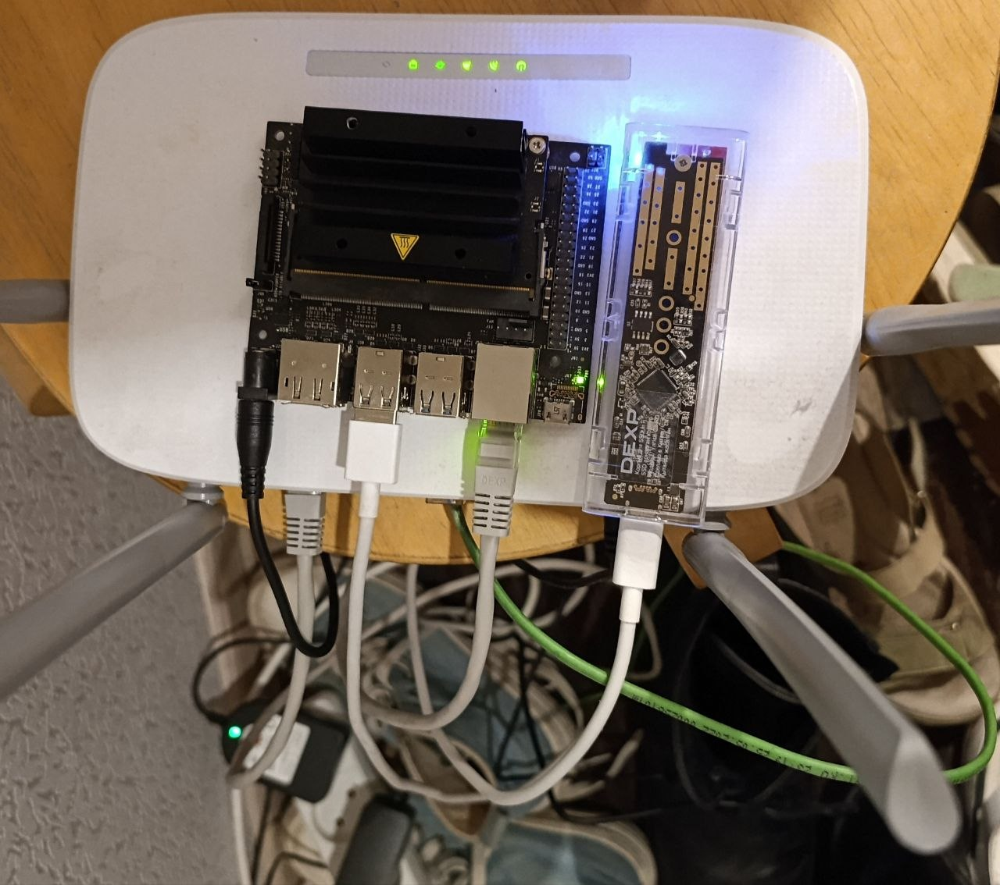

# NASA Home Cloud
### _Old hardware should live_ · _Старое железо должно жить_

[](LICENSE)
[](https://github.com/AlexeyBorovskoy/Nasa_home/releases)
[](https://developer.nvidia.com/embedded/jetson-nano-developer-kit)
[](docker/compose/)
[](https://claude.ai/code)
[](CONTRIBUTING.md)  
[](https://github.com/AlexeyBorovskoy/Nasa_home/stargazers)
[](https://github.com/AlexeyBorovskoy/Nasa_home/discussions)
[](https://github.com/AlexeyBorovskoy/Nasa_home/issues)
[](https://github.com/AlexeyBorovskoy/Nasa_home/actions/workflows/secrets-check.yml)

> 🇷🇺 В ящике лежал NVIDIA Jetson Nano — купил когда-то для экспериментов, поиграл неделю и забыл.
> Сын принёс плату DEXP с 232 ГБ памяти — «папа, пригодится». Пригодилась.
> Вместо того чтобы покупать что-то новое — взял то, что уже было, и сделал из этого домашний сервер.
> Заменил Google Фото, Google Drive и Яндекс.Диск. Задумал я — реализовал [Claude Code](https://claude.ai/code). **Новичок тоже справится.**
>
> 🇬🇧 Had an NVIDIA Jetson Nano sitting in a drawer — bought it for experiments, tinkered for a week, then forgot about it.
> My son brought a DEXP board with 232 GB storage — "dad, you'll need this". He was right.
> Instead of buying new hardware — used what was already there and turned it into a proper home server.
> Replaced Google Photos, Google Drive, and Yandex.Disk. My vision — [Claude Code](https://claude.ai/code) did the implementation. **Beginners can do this too.**

**Если проект полезен — поставь ⭐ звезду, это помогает другим его найти.**  
**If you find this useful — please ⭐ star this repo so others can discover it.**


*Jetson Nano на роутере + DEXP-плата от сына (232 ГБ) · реальный стенд проекта*

---

## Зачем это нужно / Why

> 🇷🇺 Семейные фото копились в Google и Xiaomi Cloud. В какой-то момент понял, что не хочу чтобы они были у кого-то ещё.
> Не хотелось тратить деньги на подписки и покупать новое железо, когда старое просто лежит.
> Решение: собрать собственный облачный сервер из того что есть.

> 🇬🇧 Family photos were piling up in Google and Xiaomi Cloud. At some point I realised I didn't want them sitting on someone else's server.
> Didn't want to keep paying for subscriptions or buy new hardware when old hardware was just sitting there.
> Solution: build a home cloud from what I already had.

| Было / Before | Стало / After |
|---|---|
| Google Фото — ваши фото у Google | **Immich** — личный фотоархив дома |
| Google Drive / Яндекс.Диск | **Nextcloud** — файлы, CalDAV, CardDAV |
| DEXP-плата (232 ГБ) — лежала без дела, принёс сын | **Samba NAS + основное хранилище** |
| ChatGPT / Claude API | **LLM Gateway** — локальный AI-ассистент, данные не уходят |
| Облачный мониторинг | **Netdata + Uptime Kuma** — всё под рукой |

---

## Содержание / Table of Contents

- [О проекте / About](#о-проекте--about)
- [Для кого / Who is this for](#для-кого--who-is-this-for)
- [Что работает прямо сейчас / What's running](#что-работает-прямо-сейчас--whats-running)
- [Архитектура / Architecture](#архитектура--architecture)
- [Стек / Stack](#стек--stack)
- [Требования / Prerequisites](#требования--prerequisites)
- [Быстрый старт / Quick Start](#быстрый-старт--quick-start)
- [Конфигурация / Configuration](#конфигурация--configuration)
- [Этапы / Stages](#этапы--stages)
- [Документация / Documentation](#документация--documentation)
- [Безопасность / Security](#безопасность--security)
- [Вклад / Contributing](#вклад--contributing)
- [Лицензия / License](#лицензия--license)


---

## О проекте / About

> 🇷🇺 Русский

Всё началось с того, что в ящике лежал NVIDIA Jetson Nano, купленный несколько лет назад для экспериментов. Поиграл, отложил и забыл. Сын принёс плату DEXP с 232 ГБ памяти — «папа, пригодится». Покупать готовый NAS или новое железо не хотелось.

Решил попробовать сделать домашний сервер из того, что уже есть. Jetson Nano оказался вполне достаточным: 4 ГБ RAM, ARM64, умеет в Docker. Плата DEXP стала целевым USB-хранилищем. На 2026-06-23 SSD снова смонтирован в `/mnt/storage`, проходит preflight, а Nextcloud после controlled start снова отвечает `HTTP 200`.

**NASA Home Cloud** — это не инсталлятор в один клик. Это инженерный шаблон: документация, Docker Compose, диагностические скрипты, systemd-юниты и промпты для агентов, позволяющие разворачивать платформу малыми проверяемыми шагами.

Принципы:

- **Приватность прежде всего** — фото, видео, контакты, календарь и резервные копии не покидают домашнюю сеть.
- **Только LAN + обратный SSH-тоннель** — сервисы недоступны напрямую из интернета; CGNAT обходится через VPS.
- **Малые шаги** — каждый блок разворачивается отдельно и проверяется перед следующим.
- **Без секретов в git** — реальные `.env`, токены, ключи и персональные данные не попадают в репозиторий.
- **Устойчивость** — `restart: always`, mem_limit, Docker healthchecks, ежедневный Telegram-отчёт, автоматический бэкап БД.

> 🇬🇧 English

It started with an NVIDIA Jetson Nano sitting in a drawer — bought years ago for experiments, tinkered with it once, then forgot about it. My son brought a DEXP board with 232 GB storage — "dad, you'll need this". Didn't want to buy a ready-made NAS or new hardware.

Decided to try building a home server from what was already there. The Jetson Nano turned out to be perfectly capable: 4 GB RAM, ARM64, Docker-ready. The DEXP board became the target USB storage. As of 2026-06-23 the SSD is mounted at `/mnt/storage` again, passes preflight, and Nextcloud is back to `HTTP 200` after a controlled start.

**NASA Home Cloud** is not a one-command installer. It is an engineering template with documentation, Docker Compose files, diagnostics, systemd units, and agent prompts for safe, step-by-step deployment.

Principles:

- **Privacy first** — photos, videos, contacts, calendars, and backups never leave the home network.
- **LAN + reverse SSH tunnel only** — services are not exposed directly to the internet; CGNAT is bypassed via VPS relay.
- **Small steps** — every deployment block is verified before moving to the next.
- **No real secrets in git** — `.env`, tokens, API keys, and personal data are excluded from the repository.
- **Resilience** — `restart: always`, mem_limit, Docker healthchecks, daily Telegram health report, automated DB backup timer.

---

## Для кого / Who is this for

> 🇷🇺 Если у вас где-то лежит Jetson Nano, Raspberry Pi 4/5 или любой мини-ПК — и он либо не используется, либо используется по крайней необходимости — этот проект для вас. Не нужно быть DevOps-инженером. Нужно быть готовым разбираться шаг за шагом.
>
> Мне не нужна была экспертиза в Docker и systemd — достаточно было сформулировать задачи для [Claude Code](https://claude.ai/code). Агент генерировал код, отлаживал, тестировал, писал документацию. Я проверял, принимал решения, говорил что делать дальше. Получился рабочий сервер.
>
> Весь лог решений открыт: промпты (`prompts/`), архитектурные решения (`docs/decisions/`), CHANGELOG с каждым шагом.

> 🇬🇧 If you have a Jetson Nano, Raspberry Pi 4/5, or any mini-PC sitting somewhere — either unused or barely used — this project is for you. You don't need to be a DevOps engineer. You just need to be willing to work through it step by step.
>
> I didn't need expertise in Docker or systemd — just the ability to formulate tasks for [Claude Code](https://claude.ai/code). The agent wrote the code, debugged it, tested it, and documented everything. I reviewed, made decisions, and directed what to do next. The result: a working home server.
>
> The full decision log is open: agent prompts (`prompts/`), architecture decisions (`docs/decisions/`), CHANGELOG with every step.

---

## Что работает прямо сейчас / What's running

> Состояние на 2026-06-24 / State as of 2026-06-24 · **Stage 1 fully operational + USB watchdog deployed**
> Jetson доступен через VPS reverse tunnel. SSD смонтирован в `/mnt/storage` (229 GB, 217 GB free).
> `storage_preflight.sh` — errors=0, warnings=0. Все 13 контейнеров `Up (healthy)`.
> USB autosuspend отключён: udev rules для RTL9210B-CG + хаба + `usbcore.autosuspend=-1`
> в extlinux.conf. smartd мониторит `/dev/sda`. Beszel Hub на VPS:8091, Agent на Jetson:45876.
> Reboot/autorecovery test passed: все сервисы восстанавливаются автоматически после ребута.

| Сервис / Service | Порт / Port | Доступ / Access | Статус / Status |
|---|---|---|---|
| Nextcloud | 8080 | VPS `193.8.215.130:8080` + LAN | ✅ Live |
| Immich | 2283 | VPS `193.8.215.130:2283` + LAN | ✅ Live |
| LLM Gateway | 8090 | VPS `193.8.215.130:8090` + LAN | ✅ Live |
| nasa-api (Swagger) | 8099 | LAN `192.168.0.50:8099/docs` | ✅ Live |
| Samba NAS | 445/139 | LAN only (192.168.0.0/24) | ✅ Live, storage-backed |
| Netdata | 19999 | LAN `192.168.0.50:19999` | ✅ Live |
| Uptime Kuma | 3001 | LAN `192.168.0.50:3001` | ✅ Live · 5 monitors configured |
| Portainer | 9000 | LAN `192.168.0.50:9000` | ✅ Live · admin configured |
| Beszel Hub | 8091 | VPS `193.8.215.130:8091` | ✅ Live · unified monitoring |
| Beszel Agent | 45876 | Jetson internal | ✅ Live · systemd, arm64 |
| VPS nginx reverse proxy | — | VPS 193.8.215.130 | ✅ Live |
| autossh tunnel | — | Jetson → VPS persistent | ✅ Live |
| Telegram daily report | — | Bot → personal chat | ✅ Live (09:00) |
| DB backup timer | — | pg_dump → /mnt/storage/backups | ✅ Live; fail-closed guard |
| USB storage watchdog | udev | udev rules + smartd | ✅ Live · autosuspend disabled |
| Android backup API | — | — | 🔜 Stage 2 |

> **Хранилище:** целевой `/mnt/storage` — DEXP/Realtek 250 GB ext4 USB storage.
> После переподключения он виден как `/dev/sda1`, смонтирован `rw,noatime`,
> `e2fsck -f -n` вернул `0`, `storage_preflight.sh` завершился без ошибок.
> История инцидента и порядок восстановления:
> [docs/plans/STORAGE_INCIDENT_2026-06-23.md](docs/plans/STORAGE_INCIDENT_2026-06-23.md),
> текущий reliability-аудит:
> [docs/plans/RELIABILITY_AUDIT_2026-06-23.md](docs/plans/RELIABILITY_AUDIT_2026-06-23.md).

---

## Архитектура / Architecture

```
Интернет / Internet
        |
        | (публичный IP / public IP)
        v
  [ VPS 193.8.215.130 — Вена / Vienna ]
        |
        |  nginx (host network, docker)
        |  :8080  → 127.0.0.1:18080 → tunnel → Jetson:8080  (Nextcloud)
        |  :2283  → 127.0.0.1:12283 → tunnel → Jetson:2283  (Immich)
        |  :8090  → 127.0.0.1:18090 → tunnel → Jetson:8090  (LLM Gateway)
        |  :10022 → tunnel → Jetson:22                       (SSH управление)
        |
        |  ↑ autossh reverse SSH tunnel (обход CGNAT)
        |
  [ Домашний роутер / Home router ]
        |  (статический DHCP: 192.168.0.50)
        v
  [ Jetson Nano 4GB · Ubuntu 18.04 · 192.168.0.50 ]
        |
        +-- Nextcloud (8080) · PostgreSQL 16 · Redis 7
        |
        +-- Immich (2283) · PostgreSQL 16 + pgvecto-rs · Redis 7
        |   IMMICH_DISABLE_MACHINE_LEARNING=true (Jetson Nano 4GB safe mode)
        |
        +-- LLM Gateway / FastAPI (8090)
        |     +-- [ DeepSeek API ] — privacy-filtered (редакция персданных)
        |
        +-- nasa-api / FastAPI (8099) · Swagger UI /docs
        |     · /v1/metrics · /v1/containers · /v1/logs · POST /v1/report/now
        |
        +-- Samba NAS (445, LAN only)
        |     iptables: разрешён только 192.168.0.0/24
        |
        +-- Netdata (19999)    — CPU, RAM, Disk, Docker, темп Jetson
        +-- Uptime Kuma (3001) — 5 HTTP мониторов + Telegram alerts
        +-- Portainer (9000)   — Docker management UI (admin настроен)
        |
        +-- systemd: nasa-tunnel.service       (autossh, restart=always)
        +-- systemd: nasa-daily-report-telegram.timer  (09:00, ежедневно)
        +-- systemd: nasa-backup.timer         (03:00, ежедневно, pg_dump)
        +-- systemd: jetson-nas-health.timer   (SMART мониторинг HDD, 6h)
        +-- systemd: beszel-agent.service      (мониторинг → Beszel Hub на VPS:8091)
        +-- udev:    85-nasa-storage-watchdog  (autosuspend=off для RTL9210B-CG + hub)
        +-- smartd:  /dev/sda monitoring       (S.M.A.R.T., weekly self-test)

/mnt/storage  (DEXP/Realtek 250 ГБ ext4 USB; mounted, fsck/preflight OK; Nextcloud live)
  ├── nextcloud/data
  ├── immich/library
  ├── db/
  │   ├── nextcloud-postgres    (~373 MB)
  │   └── immich-postgres
  ├── backups/
  │   └── database-dumps/       (pg_dump · gzip · ротация 7 дней)
  └── samba/public
```

**Docker Compose файлы:**

| Файл / File | Назначение / Purpose |
|---|---|
| `docker/compose/docker-compose.nextcloud.yml` | Nextcloud + PostgreSQL + Redis |
| `docker/compose/docker-compose.immich.yml` | Immich + PostgreSQL + Redis |
| `docker/compose/docker-compose.llm-gateway.yml` | LLM Gateway (FastAPI) |
| `docker/compose/docker-compose.samba.yml` | Samba NAS (ARM64, SMB2+) |
| `docker/compose/docker-compose.monitoring.yml` | Netdata + Uptime Kuma + Portainer |
| `docker/compose/docker-compose.nasa-api.yml` | nasa-api (FastAPI, Swagger, JSON logs) |
| `docker/vps/docker-compose.yml` | nginx reverse proxy на VPS (`network_mode: host`) |

---

## Стек / Stack

| Область / Area | Компонент | Версия | Роль |
|---|---|---|---|
| Файлы и документы | Nextcloud | latest (apache) | File cloud, WebDAV, CalDAV, CardDAV |
| Фото и видео | Immich | release | Photo/video archive, Android sync |
| Базы данных | PostgreSQL | 16 / pgvecto-rs | Nextcloud DB + Immich DB |
| Кэш / Очереди | Redis | 7-alpine | Nextcloud cache + Immich queue |
| Локальный NAS | Samba (crazymax/samba) | latest ARM64 | SMB2+ для Windows/Android/macOS |
| LLM-шлюз | FastAPI LLM Gateway | — | Privacy shim, редакция персданных |
| LLM API | DeepSeek API | deepseek-chat | Помощник администратора |
| Admin API | nasa-api (FastAPI) | — | Метрики, логи, контейнеры, Swagger UI |
| Тоннель | autossh + systemd | — | Reverse SSH через CGNAT → VPS |
| VPS прокси | nginx:alpine | — | Reverse proxy на публичный порт |
| Мониторинг | Netdata | latest ARM64 | CPU, RAM, Disk, Docker, Jetson temp |
| Uptime | Uptime Kuma | 1 | HTTP uptime + Telegram алерты (5 мониторов) |
| Docker UI | Portainer CE | latest | Web UI для Docker management |
| Ежедневный отчёт | bash + SSH relay + Telegram | — | 09:00 отчёт о здоровье кластера |
| Бэкап БД | bash pg_dump + gzip | — | 03:00 ежедневно, ротация 7 дней |
| Тестирование | goss v0.4.9 (ARM64) | — | Infrastructure state tests (34 теста) |
| Здоровье системы | systemd timers + SMART | — | Диагностика 6ч + HDD health |
| Unified monitoring | Beszel | 0.18.7 | Hub на VPS, Agent на Jetson — CPU/RAM/disk/net история |
| Бэкапы файлов | restic | — | Stage 3 (заготовка готова) |
| Android backup API | services/backup-api | — | Stage 2 placeholder |

---

## Требования / Prerequisites

**Железо / Hardware:**

| Компонент | Рекомендация |
|---|---|
| Вычислительный узел | NVIDIA Jetson Nano Developer Kit (4 GB) · или Raspberry Pi 4/5 · или любой мини-ПК |
| Системный диск | microSD 64 GB (Class 10 / A2) |
| Диск данных | USB SSD/HDD — любой USB-накопитель; в проекте: DEXP 232 ГБ (от сына) |
| Сеть | Домашняя LAN, статический DHCP lease |
| Внешний доступ | VPS (любой; проверено на Ubuntu 24.04, 1 vCPU, 2 GB RAM) |

**ПО на Jetson / Software on Jetson:**

- L4T / JetPack 4.x (Ubuntu 18.04) · или Ubuntu 22.04 (на RPi/мини-ПК)
- Docker Engine 20.10+, Docker Compose v2
- autossh (`apt install autossh`)
- curl, openssl (`apt install curl openssl`)
- SSH-ключ для VPS в `~/.ssh/`

**ПО на VPS:**

- Docker + Docker Compose v2
- UFW: открыть порты 8080, 2283, 8090, 10022 (и 22 для SSH)
- SSH: разрешить вход от Jetson-ключа

---

## Быстрый старт / Quick Start

### 1. Клонировать / Clone

```bash
git clone https://github.com/AlexeyBorovskoy/Nasa_home.git ~/nasa
cd ~/nasa
cp config/.env.example config/.env
chmod 600 config/.env
nano config/.env   # заполнить пароли, пути, DeepSeek API key
```

### 2. Настроить VPS / Setup VPS

```bash
# На VPS:
mkdir -p /opt/nasa
scp -r docker/vps/ root@<VPS_IP>:/opt/nasa/
ssh root@<VPS_IP> "cd /opt/nasa/vps && docker compose up -d"
```

### 3. Настроить тоннель на Jetson / Setup tunnel on Jetson

```bash
# На Jetson:
ssh-keygen -t ed25519 -f ~/.ssh/id_ed25519
ssh-copy-id -i ~/.ssh/id_ed25519.pub root@<VPS_IP>

sudo cp systemd/nasa-tunnel.service /etc/systemd/system/
sudo systemctl daemon-reload && sudo systemctl enable --now nasa-tunnel.service
```

### 4. Запустить сервисы / Start services

```bash
# На Jetson:
cd ~/nasa
docker compose -f docker/compose/docker-compose.nextcloud.yml   --env-file config/.env up -d
docker compose -f docker/compose/docker-compose.immich.yml      --env-file config/.env up -d
docker compose -f docker/compose/docker-compose.llm-gateway.yml --env-file config/.env up -d
docker compose -f docker/compose/docker-compose.monitoring.yml  --env-file config/.env up -d
docker compose -f docker/compose/docker-compose.nasa-api.yml    --env-file config/.env up -d
```

### 5. Настроить Telegram-отчёты / Setup Telegram reports

```bash
# На Jetson:
sudo mkdir -p /etc/nasa-monitor /var/log/nasa-monitor
sudo cp scripts/monitoring/nasa-daily-report.sh /usr/local/sbin/
sudo cp scripts/monitoring/nasa-send-report-telegram.sh /usr/local/sbin/
sudo chmod +x /usr/local/sbin/nasa-*.sh

sudo tee /etc/nasa-monitor/telegram.env <<EOF
TELEGRAM_BOT_TOKEN=<your-token>
TELEGRAM_CHAT_ID=<your-chat-id>
EOF
sudo chmod 600 /etc/nasa-monitor/telegram.env

sudo cp systemd/nasa-daily-report-telegram.{service,timer} /etc/systemd/system/
sudo systemctl daemon-reload
sudo systemctl enable --now nasa-daily-report-telegram.timer
```

### 6. Автоматическая настройка UI и бэкапов / Automated UI + backup setup

```bash
# На Jetson:
# Бэкап таймер (pg_dump · 03:00 ежедневно)
bash scripts/backup/install_backup_timer.sh

# Portainer admin (генерирует пароль автоматически)
bash scripts/monitoring/setup_portainer.sh

# Uptime Kuma: admin + 5 мониторов
docker run --rm --network host \
  -v ~/nasa/scripts/monitoring/setup_uptime_kuma.py:/setup.py:ro \
  -e UPTIME_KUMA_ADMIN_USER=admin \
  -e UPTIME_KUMA_ADMIN_PASSWORD=<your-password> \
  -e JETSON_LAN_IP=192.168.0.50 \
  python:3.12-slim bash -c 'pip install uptime-kuma-api -q && python3 /setup.py'
```

### 7. Проверить / Verify

```bash
curl -sf http://localhost:8080/status.php         # Nextcloud → {"installed":true,...}
curl -sf http://localhost:2283/api/server/ping    # Immich → {"res":"pong"}
curl -sf http://localhost:8090/health             # LLM Gateway → {"status":"ok"}
curl -sf http://localhost:8099/healthcheck        # nasa-api → {"status":"ok"}
curl -sf http://localhost:19999/api/v1/info       # Netdata → {...}

goss -g tests/goss/goss.yaml validate --format tap   # 34 infrastructure tests
```

Web UI:
- **Swagger:** http://192.168.0.50:8099/docs
- **Netdata:** http://192.168.0.50:19999
- **Uptime Kuma:** http://192.168.0.50:3001
- **Portainer:** http://192.168.0.50:9000

Полный план тестирования: [docs/14_TEST_PLAN.md](docs/14_TEST_PLAN.md).  
Подготовка microSD: [docs/01A_JETSON_SD_BOOTSTRAP.md](docs/01A_JETSON_SD_BOOTSTRAP.md).  
Операционный runbook: [docs/13_MONITORING_RUNBOOK.md](docs/13_MONITORING_RUNBOOK.md).

---

## Конфигурация / Configuration

Все переменные — в `config/.env` (не коммитится). Шаблон: `config/.env.example`.

```bash
# Хранилище
STORAGE_ROOT=/mnt/storage
NEXTCLOUD_DATA=/mnt/storage/nextcloud/data
IMMICH_UPLOAD_LOCATION=/mnt/storage/immich/library
BACKUP_ROOT=/mnt/storage/backups

# Базы данных
NEXTCLOUD_DB_PASSWORD=changeme
IMMICH_DB_PASSWORD=changeme
REDIS_PASSWORD=changeme

# VPS tunnel
VPS_HOST=your.vps.ip
VPS_USER=root
VPS_SSH_KEY=/home/admin/.ssh/id_ed25519

# LLM Gateway
DEEPSEEK_API_KEY=sk-...
DEEPSEEK_MODEL=deepseek-chat
IMMICH_DISABLE_MACHINE_LEARNING=true   # обязательно для Jetson Nano 4GB
```

Никогда не коммитьте реальный `config/.env`. Он в `.gitignore`.

---

## Этапы / Stages

| Этап / Stage | Содержание / Content | Статус / Status |
|---|---|---|
| Stage 0 | microSD, первый boot, SSH, USB device mode | ✅ Задокументировано |
| Stage 1A | Hardware audit, DEXP USB storage setup, Samba NAS | ✅ **Storage recovered; reboot verified** |
| Stage 1B | Nextcloud + PostgreSQL + Redis | ✅ **Recovered; DB/Redis healthy; reboot verified** |
| Stage 1C | Immich (ML отключён для Jetson) | ✅ **Развёрнут и работает** |
| Stage 1D | LLM Gateway + DeepSeek | ✅ **Развёрнут и работает** |
| Stage 1E | VPS + reverse SSH tunnel (autossh) | ✅ **Работает, nginx на VPS** |
| Stage 1F | Мониторинг (Netdata, Uptime Kuma, Portainer) | ✅ **Развёрнут и работает** |
| Stage 1G | nasa-api (FastAPI, Swagger, JSON logs) + Telegram отчёт | ✅ **Развёрнут и работает** |
| Stage 1H | Resilience audit: healthchecks, mem_limit, goss | ✅ **8/10 findings fixed** |
| Stage 1 Ops | Uptime Kuma (5 мониторов) + Portainer (admin) + бэкап-таймер | ✅ **Monitoring + fail-closed backup live** |
| Stage 2 | Android backup/restore client API | 📋 Архитектура готова |
| Stage 3 | Backup / restore (restic full + pg\_dump) | 🔜 Скрипты готовы |
| Stage 3.1 | USB HDD: резервное расширение хранилища (NTFS + ext4 гибрид) | 📋 Готово к подключению |
| Stage 4 | Analytics, RAG, fallback LLM providers | 📋 Будущее |

---

## Документация / Documentation

| Файл / File | Описание / Description |
|---|---|
| [docs/00_OVERVIEW.md](docs/00_OVERVIEW.md) | Обзор концепции / Project concept overview |
| [docs/01_HARDWARE_AUDIT.md](docs/01_HARDWARE_AUDIT.md) | Аппаратный аудит Jetson Nano |
| [docs/01A_JETSON_SD_BOOTSTRAP.md](docs/01A_JETSON_SD_BOOTSTRAP.md) | Подготовка microSD, первый boot |
| [docs/03_ARCHITECTURE.md](docs/03_ARCHITECTURE.md) | Архитектурная схема |
| [docs/04_STORAGE_DESIGN.md](docs/04_STORAGE_DESIGN.md) | Дизайн хранилища (USB HDD, mount, fstab) |
| [docs/05_NETWORKING_VPN.md](docs/05_NETWORKING_VPN.md) | LAN/VPN-модель, тоннели, порты |
| [docs/06_NEXTCLOUD_DESIGN.md](docs/06_NEXTCLOUD_DESIGN.md) | Дизайн Nextcloud |
| [docs/07_IMMICH_DESIGN.md](docs/07_IMMICH_DESIGN.md) | Дизайн Immich (Jetson-safe) |
| [docs/08_LLM_GATEWAY_DEEPSEEK.md](docs/08_LLM_GATEWAY_DEEPSEEK.md) | LLM Gateway и DeepSeek API |
| [docs/12_BACKUP_RESTORE.md](docs/12_BACKUP_RESTORE.md) | Backup и restore workflow |
| [docs/13_MONITORING_RUNBOOK.md](docs/13_MONITORING_RUNBOOK.md) | Runbook: диагностика, бэкапы, Uptime Kuma, Netdata |
| [docs/14_TEST_PLAN.md](docs/14_TEST_PLAN.md) | План тестирования по этапам |
| [docs/17_MONITORING_OBSERVABILITY.md](docs/17_MONITORING_OBSERVABILITY.md) | Анализ инструментов мониторинга |
| [docs/19_NETWORK_INVENTORY.md](docs/19_NETWORK_INVENTORY.md) | Сетевой паспорт стенда |
| [docs/20_AGENT_OPERATING_MODEL.md](docs/20_AGENT_OPERATING_MODEL.md) | Операционная модель субагентов |
| [docs/21_LOGGING_API.md](docs/21_LOGGING_API.md) | JSON-логирование и nasa-api (Swagger) |
| [docs/22_AUDIT_RESILIENCE.md](docs/22_AUDIT_RESILIENCE.md) | Аудит надёжности: goss, shellcheck, итоги |
| [docs/23_GITHUB_INTEGRATION.md](docs/23_GITHUB_INTEGRATION.md) | GitHub CLI + Claude Code интеграция, AI DevOps workflow |
| [docs/24_CLIENT_SETUP.md](docs/24_CLIENT_SETUP.md) | **Подключение устройств: Android, Windows, Linux** |
| [docs/metrics/GITHUB_TRAFFIC.md](docs/metrics/GITHUB_TRAFFIC.md) | Ежедневный мониторинг GitHub трафика, клонов, звёзд — целевые метрики |
| [docs/plans/STORAGE_INCIDENT_2026-06-23.md](docs/plans/STORAGE_INCIDENT_2026-06-23.md) | USB storage incident: `error -71`, recovery status, Nextcloud controlled start |
| [docs/plans/RELIABILITY_AUDIT_2026-06-23.md](docs/plans/RELIABILITY_AUDIT_2026-06-23.md) | Live reliability audit: fsck/preflight, boot guard, restart policy, remaining risks |
| [docs/plans/VPS_INTEGRATION_PLAN.md](docs/plans/VPS_INTEGRATION_PLAN.md) | План интеграции VPS + тоннель |
| [AGENTS.md](AGENTS.md) | Правила для Codex/агентов |
| [PROJECT_CONTEXT.md](PROJECT_CONTEXT.md) | Зафиксированные решения и ограничения |
| [archtectura_nasa.md](archtectura_nasa.md) | Полная архитектурная карта (Mermaid) |

---

## Безопасность / Security

- Не коммитьте реальные `.env`, ключи, токены, дампы и персональные данные.
- LLM Gateway блокирует отправку фото, видео, контактов и ключей во внешний API.
- Samba доступна только из локальной сети (`iptables`: 192.168.0.0/24 → 445/139).
- VPS nginx слушает публичные порты, но данные хранятся только на Jetson.
- Telegram-токен передаётся через зашифрованный SSH-туннель, не раскрывается в `ps aux` на VPS.

Проверка перед push:

```bash
./scripts/security/check_no_secrets.sh
```

CI автоматически проверяет секреты: `.github/workflows/secrets-check.yml`.

Полная политика: [SECURITY.md](SECURITY.md) · [docs/10_SECURITY_PRIVACY.md](docs/10_SECURITY_PRIVACY.md) · [docs/11_SECRETS_POLICY.md](docs/11_SECRETS_POLICY.md).

---

## Известные ограничения / Known Limitations

- **USB autosuspend fix deployed 2026-06-24** — RTL9210B-CG (`0bda:9210`) и Realtek USB hub теперь удерживаются в `power/control=on` через udev rules. `usbcore.autosuspend=-1` добавлен в extlinux.conf (активен после следующего ребута). До ребута уdev rules защищают. SSD стабилен. При повторном `error -71` — физически переподключить USB.
- **Nextcloud recovered after controlled start** — `homecloud_nextcloud` снова `running/healthy`; прежний HTTP 503 был следствием read-only remount во время USB-инцидента.
- `scripts/backup/backup_databases.sh` работает fail-closed: если `/mnt/storage` не является отдельным mountpoint, backup не пишется в ложный каталог на microSD.
- `services/backup-api` — Stage 2 placeholder, не production backup-сервис.
- Immich работает без machine learning (`IMMICH_DISABLE_MACHINE_LEARNING=true`) — Jetson Nano 4 GB с ML не тестировался.
- VPS IP может меняться — при смене обновить `VPS_HOST` в `config/.env` на Jetson и перезапустить `nasa-tunnel.service`.
- Docker 20.10.7 (JetPack 4.x) — устаревший. Обновление нетривиально из-за зависимостей NVIDIA runtime. Для home lab допустимо.
- HTTPS для VPS nginx — Let's Encrypt не настроен (нет доменного имени).

---

## Вклад / Contributing

Вклад приветствуется. Прочитайте [CONTRIBUTING.md](CONTRIBUTING.md) перед тем, как открывать pull request.

**Есть вопрос или идея?** Заходи в [Discussions](https://github.com/AlexeyBorovskoy/Nasa_home/discussions) — там есть тема для знакомства и Q&A.

Правила:
- Не коммитьте секреты и персональные данные.
- Предпочитайте небольшие PR с документацией.
- Stage 1 должен оставаться безопасным: нет прямого публичного доступа к сервисам.

Хорошие первые задачи / Good first issues:
- [#5 Адаптация под Raspberry Pi 4/5](https://github.com/AlexeyBorovskoy/Nasa_home/issues/5) — только документация, без изменения кода.
- [#4 HTTPS (Let's Encrypt) для VPS nginx](https://github.com/AlexeyBorovskoy/Nasa_home/issues/4) — нужен домен и базовый nginx.
- [#6 Netdata Telegram alerts](https://github.com/AlexeyBorovskoy/Nasa_home/issues/6) — настроить и описать в docs.
- CI shellcheck для всех bash-скриптов в `scripts/`.
- Подключение **USB HDD** как резервного хранилища (Stage 3.1, план готов в `docs/04_STORAGE_DESIGN.md`).

---

## Лицензия / License

MIT — см. [LICENSE](LICENSE).
