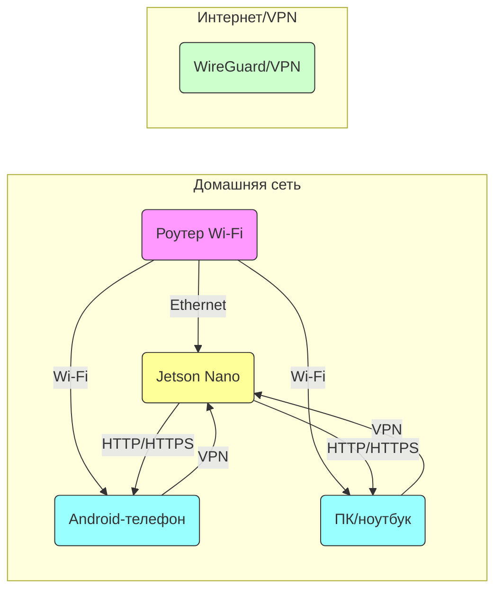
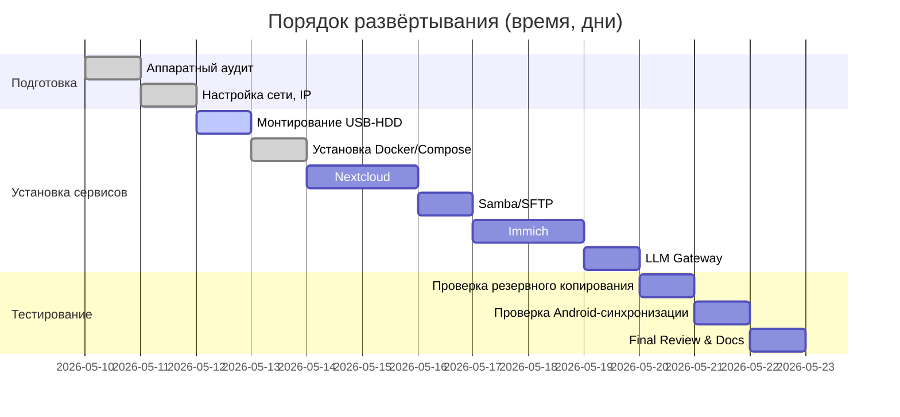

# Архитектура проекта

Проект «Домашнее семейное облако на Jetson Nano» состоит из следующих слоёв:



- **Jetson Nano** (Ubuntu, Docker) с подключенным по USB HDD (с собственным питанием).  
- **Роутер** (TP-Link EC220-G5): резервирует за Jetson статический локальный IP. На первом этапе внешних портов не открываем (VPN для доступа извне).  
- **Сервисы** на Jetson в Docker Compose: Nextcloud (файлы, календарь, контакты), Immich (фото/видеоархив), СУБД (PostgreSQL/MariaDB, Redis), **LLM Gateway** (прокси-запросов к DeepSeek API), а также **Samba/SFTP** для локального NAS.  
- **VPN (WireGuard/Tailscale)** для безопасного доступа из внешней сети.  
- **Резервное копирование**: запланированные задачи (restic или borgbackup) для бэкапа HDD и дампов баз.  

Nextcloud обеспечивает обмен файлами, синхронизацию календаря и контактов, доступ по WebDAV, а также автозагрузку фото/видео с Android【20†L150-L158】【13†L53-L58】. Immich — это self-hosted альтернатива Google Photos для хранения фото и видео; он умеет авто-резервировать медиа с телефонов и предоставляет web-интерфейс галереи. DeepSeek API используется как внешний LLM-помощник (диагностика логов, подсказки), **локальной LLM на Jetson нет**. Архитектурно мы заранее закладываем возможности перехода на OpenAI API или локальные модели, но на первом этапе используем только DeepSeek (более дешевый API). 

Резюмируя: Jetson Nano выступает как NAS/облачный сервер, в котором **Nextcloud** реализует файловое облако и PIM (контакты, календарь через DAVx5 на Android), а **Immich** — фотоархив. Внешний доступ по VPN. LLM-слой (DeepSeek) подключается через отдельный сервис LLM Gateway.  

# Структура проекта

```
home-cloud-jetson/
├── README.md                     # Краткое описание проекта (основные цели, состав системы)
├── AGENTS.md                     # Правила работы агентов Codex (инструкции и роль агентов)
├── PROJECT_CONTEXT.md            # Контекст проекта (цели, окружение, запрос заказчика)
├── PROJECT_TREE.txt              # Фиктивная схема структуры проекта
├── .gitignore
├── config/
│   ├── .env.example              # Шаблон .env (ключи, переменные окружения)
│   └── llm-policy.yaml           # Политика использования DeepSeek (приватность)
├── docker/
│   └── compose/                  # Шаблоны Docker Compose (Nextcloud, Immich, LLM Gateway)
├── docs/
│   ├── 00_OVERVIEW.md            # Исполнительное резюме проекта
│   ├── 01_REQUIREMENTS.md       # Требования (железо, ПО, сеть)
│   ├── 02_ARCHITECTURE.md       # Детальная архитектура (диаграммы, сети, порты, env)
│   ├── 03_STORAGE_DESIGN.md     # Дизайн хранилища (структура /mnt/storage на HDD)
│   ├── 04_NEXTCLOUD.md          # Nextcloud: настройка, порты, БД, env-переменные
│   ├── 05_IMMICH.md            # Immich: настройка, env-переменные, оптимизация
│   ├── 06_ANDROID_CLIENT.md    # План Android-клиента (архитектура, manifest.json API)
│   ├── 07_LLM_GATEWAY.md       # LLM Gateway: API-конракт, адаптеры, промты, контроль трафика
│   ├── 08_SECURITY_PRIVACY.md  # Безопасность: Firewall, VPN, политика приватности (DeepSeek)
│   ├── 09_SECRETS_POLICY.md    # Политика секретов: хранение ключей и паролей
│   ├── 10_BACKUP_RESTORE.md    # План резервного копирования и восстановления (restic, дампы)
│   ├── 11_MONITORING_RUNBOOK.md # Мониторинг и операционный регламент (SMART, tegrastats)
│   ├── 12_TEST_PLAN.md         # План тестирования (проверки каждого компонента)
│   └── 13_ALTERNATIVES.md      # Сравнение альтернатив (таблица решений)
├── services/
│   ├── llm-gateway/            # Код/скрипты LLM Gateway (DeepSeek/опции OpenAI)
│   └── backup-api/             # Заготовка сервиса Backup API (для Android Stage2)
├── scripts/
│   ├── diagnostics/            # Скрипты диагностики (hardware check, health)
│   ├── backup/                 # Скрипты резервного копирования
│   └── maintenance/            # Скрипты обслуживания (cleanup, обновления)
└── prompts/
    ├── CODEX_BOOTSTRAP_PROMPT.md     # Prompts для первичной инициализации проекта
    ├── CODEX_NEXTCLOUD_PROMPT.md     # Prompts для развёртывания Nextcloud
    ├── CODEX_IMMICH_PROMPT.md        # Prompts для развёртывания Immich
    ├── CODEX_LLM_GATEWAY_PROMPT.md   # Prompts для разработки LLM Gateway
    ├── CODEX_SECURITY_PROMPT.md      # Prompts для аудита безопасности
    └── CODEX_ANDROID_STAGE2_PROMPT.md# Prompts для Android Stage‑2 (backup app)
```

# Описание файлов MD

- **README.md** — краткое описание проекта и общей идеи (Nextcloud+Immich+DeepSeek), инструкции по началу работы.  
- **AGENTS.md** — свод правил для агентов (Codex), их роли и форматы вывода (не комментировать мета-инструкции).  
- **PROJECT_CONTEXT.md** — контекст и цели проекта, профиль пользователя, ограничения (русский язык, традиционный стиль).  
- **PROJECT_TREE.txt** — текстовая схема структуры проекта (как вышеприведённая).  
- **docs/00_OVERVIEW.md** — **Исполнительное резюме**: цель системы (семейное облако), ключевые компоненты, выгоды, риски.  
- **docs/01_REQUIREMENTS.md** — апаратные и программные требования: Jetson Nano 4 GB, microSD, USB HDD (с питанием), сеть; ПО (Docker, Compose, базы), приложения (Android DAVx5, Nextcloud-Client, Immich-Client).  
- **docs/02_ARCHITECTURE.md** — архитектурная схема (сетевой и программный контекст). Указать IP-адреса, порты (Nextcloud 80/443, Immich 2283 и т.п.), VPN, прокси. Включить mermaid-диаграмму сети и потоков.  
- **docs/03_STORAGE_DESIGN.md** — как монтировать HDD (например, `UUID=<...>  /mnt/storage  ext4  defaults  0 2` в `/etc/fstab`). Структура директорий `/mnt/storage`: `nextcloud/data`, `immich/library`, `db/`, `backups/`, `samba/` и т.д. Политика разметки (ext4 на весь диск).  
- **docs/04_NEXTCLOUD.md** — детали установки Nextcloud: переменные окружения в `.env` (например, `NEXTCLOUD_VERSION`, `ADMIN_USER`, `ADMIN_PASSWORD`, `DB_NAME` и т.д.), связи с БД (PostgreSQL) и Redis, пример docker-compose для Nextcloud (порт 80/443, SSL через Caddy). Ссылки на официальную доку (Nextcloud) и руководство (в Nextcloud поддерживаются Calendar/Contacts через CardDAV)【20†L150-L158】. Указать, что Android-клиент Nextcloud умеет автозагрузку файлов и синхронизирует через WebDAV.  
- **docs/05_IMMICH.md** — детали установки Immich: `.env` (как в доке Immich), директорий `UPLOAD_LOCATION`, `DB_DATA_LOCATION` и переменных (`IMMICH_VERSION`, `DB_PASSWORD`, `TZ`)【2†L80-L88】【39†L71-L75】. Привести требования по памяти/CPU: Immich при ML требует ≥6 GB RAM, без ML – 4 GB【39†L71-L75】. Рекомендации: отключить машинное обучение (чтобы Jetson не перегружать) и не включать транскодирование видео, пока система не протестирована. Небольшой пример docker-compose для Immich (подключение к сети прокси).  
- **docs/06_ANDROID_CLIENT.md** — план собственного Android-приложения (Stage 2). Архитектура: модули авторизации (регистрация телефона), сбор данных (DCIM, Documents, SMS/CallLog), передача через HTTP API. Форматы данных: фотографии/видео загружаются напрямую, контакты экспортируются в vCard, календарь – в iCal, SMS/журналы в JSON. Структура `manifest.json` бэкапа (пример с датой, ID устройства, списком синхронизированных элементов). REST API-сервисы на сервере (FastAPI/Node.js): `/api/v1/backups/create`, `/upload`, `/list`, `/restore`. Код без учета root-пермишен: телефоны см. без системных настроек.  
- **docs/07_LLM_GATEWAY.md** — дизайн LLM Gateway: единая точка обращения к LLM. API-конракт: клиент приложения вызывает локально развернутый сервис (напр. `POST /llm/chat` с {prompt, context, model}), он перенаправляет запрос к DeepSeek API (HTTPS). Конфигурация провайдера: DeepSeek (базовый URL, ключ API, модель), fallback – OpenAI (совместимый API). Шаблоны системных и пользовательских промтов для типовых запросов (диагностика, runbook). Механизмы контроля: лимит расходов (екземпляр параметров в `.env`, ежедневный лимит токенов), логирование запросов/ответов (без чувствительных данных). Фильтр приватности: обрезать телефоны, имена, адреса в промте, отправлять только техническую информацию и контекст (логи).  
- **docs/08_SECURITY_PRIVACY.md** — политика безопасности и приватности: ограничение доступа (брандмауэр, VPN), принципы шифрования (HTTPS/TLS через reverse proxy). **DeepSeek Privacy**: согласно политике DeepSeek, **не следует передавать чувствительные личные данные** (включая контакты, фотографии, приватные документы)【10†L110-L114】. Нужно делать анонимизацию: e-mail, ФИО, телефон удалять из текстовых запросов. Не отправлять медиа-файлы. Ссылки на стандарты шифрования и OS-hardening.   
- **docs/09_SECRETS_POLICY.md** — политика хранения секретов: все ключи и пароли выносить в `.env` или secrets, не коммитить в Git. Шифрование файлов `.env` в repos (Git-crypt/GPG). Права доступа: `chmod 600` на `.env`, `000` на секретные ключи. Обработка ROT13/BASE64 (неэффективно) → лучше использовать менеджер (Vault).  
- **docs/10_BACKUP_RESTORE.md** — схема бэкапа: использовать **restic** или **borgbackup**. Регулярный бэкап раз в день (cron):  
  1) **Бэкап Nextcloud/Immich**: дамп БД (`pg_dump` или `mysqldump`) и копия `data`-директорий.  
  2) Репликация HDD: `restic backup /mnt/storage` на внешний диск или в облако. Настроить политику хранения (retention 7d:30d:1y).  
  3) Проверка восстановления: `restic restore` или импорт бэкапа Nextcloud.  
  Привести пример конфигурации restic (`export RESTIC_REPOSITORY`, `RESTIC_PASSWORD`). Иллюстрация процесса как диаграмма или командами.  
- **docs/11_MONITORING_RUNBOOK.md** — процедуры мониторинга и реагирования:  
  - **Техдиагностика**: SMART (smartctl: `sudo smartctl -a /dev/sda`), проверка температуры и загрузки (`tegrastats`)【30†L23-L31】, `df -h`, `docker stats`, системные логи (`journalctl`).  
  - **Health checks**: проверка «живости» контейнеров (`docker compose ps`), здоровья `curl` на Nextcloud/Immich, проброс SMB/SFTP доступа.  
  - **Alerts**: конфигурировать отправку сообщений (Telegram/Email) при недоступности сервиса или заполнении диска >85%.  
  - **Runbook**: пошаговая инструкция на случай сбоя (привести пример «проверка SSH, перезапуск сервисов, восстановление из бэкапа»).  
- **docs/12_TEST_PLAN.md** — план тестирования:  
  1) Unit-тесты (при разработке Android-API).  
  2) Интеграционные: запуск Nextcloud, вход в web, создание пользователя, загрузка файлов; проверка автосинхронизации с телефона.  
  3) Immich: загрузка 20–50 фото и несколько видео, проверка что они видны в WebUI; симуляция сбоя (выключить Immich, включить обратно и убедиться, что коллекция сохранена).  
  4) DeepSeek: тестовые запросы через LLM Gateway, например: «статус Nextcloud», «существует ли Syncthing?», убедиться в адекватных ответах.  
  5) Security: попытка подключиться без VPN (должно блокироваться), проверка CORS.  
- **docs/13_ALTERNATIVES.md** — сравнение альтернатив:

  | Решение      | Категория         | Основное назначение                      | Преимущества                                      | Ограничения                                |
  |--------------|-------------------|------------------------------------------|--------------------------------------------------|--------------------------------------------|
  | **Nextcloud**| Облако (файлы)    | Самостоятельное облако (документы, календарь, контакты, файлы)【20†L150-L158】 | Множество интеграций, расширяемость, активная поддержка; календарь/контакты; шифрование E2E【13†L53-L58】 | Сложнее в установке и оптимизации; ресурсоёмкость |
  | **Seafile**  | Облако (файлы)    | Фокус на файловой синхронизации          | Блок-синхронизация (быстро переносит большие файлы), меньше нагрузки【13†L53-L58】    | Меньше встроенных приложений; вопросы конфиденциальности (Китай)【20†L174-L178】 |
  | **Syncthing**| P2P-синхрон.      | Синхронизация папок между устройствами   | Отсутствие центрального сервера, проста для однорангового обмена; шифрование| Нет общего облачного хранилища; нет управления правами |
  | **Pydio**    | Облако (файлы)    | Корпоративный обмен файлами【42†L158-L160】  | Обширные возможности интеграции (LDAP, SSO, хранилище SAN); modular (Go) | Сложнее в развёртывании; коммерческая поддержка (Cells) |
  | **Cozy**     | Облако (личный)   | Личное облако с календарём, почтой и т.д.| Интегрировано с «домашними» приложениями, ориентированно на пользователя | Меньше энтузиастов, скуднее экосистема         |
  | **Immich**   | Фотоархив         | Резервное копирование фото/видео с телефона【39†L71-L75】 | Мобильные приложения для автоматического backup, умная организация фото, распознавание лиц| Фокус именно на фото с телефона, слабее для загрузки «старых» библиотек; требует Docker/СУБД |
  | **PhotoPrism** | Фотоархив       | Каталогизация «зрелой» фото-библиотеки | Локальная индексация, отличная фильтрация по метаданным и ML (поиск по объектам)【22†L463-L470】 | Тяжёлый для маломощного железа (ML без GPU медленное); нет мобильных приложений |
  | **Lychee/Piwigo** | Фотоархив    | Хостинг фото (галерея)                   | Лёгкие, веб-интерфейс для просмотра фото         | Минимум функций автоматической загрузки; без глубокой аналитики |
  
  (Примечание: Nextcloud уступает Seafile в скорости синхронизации, но выигрывает за счёт богатой экосистемы【13†L53-L58】. Syncthing отлично подходит для простого обмена файлами без сервера【20†L174-L178】. Immich оптимизирован для backup-фото, тогда как PhotoPrism лучше для архивов больших фотоальбомов【22†L495-L504】.)  

# Пример Docker Compose (фрагменты)

```yaml
version: '3.8'
services:
  nextcloud:
    image: nextcloud:25-fpm
    restart: unless-stopped
    environment:
      - MYSQL_PASSWORD=${MYSQL_PASSWORD}
      - REDIS_HOST=redis
    volumes:
      - ./nextcloud-data:/var/www/html/data
    networks:
      - internal
    ports:
      - "8080:80"
  db:
    image: mariadb:10.11
    restart: unless-stopped
    environment:
      - MYSQL_ROOT_PASSWORD=${MYSQL_ROOT_PASSWORD}
      - MYSQL_DATABASE=nextcloud
      - MYSQL_USER=nextcloud
      - MYSQL_PASSWORD=${MYSQL_PASSWORD}
    volumes:
      - ./db:/var/lib/mysql
    networks:
      - internal
  redis:
    image: redis:7
    restart: unless-stopped
    networks:
      - internal
  immich-server:
    image: ghcr.io/immich-app/immich:latest
    restart: unless-stopped
    volumes:
      - ./immich-data:/data
    depends_on: [immich-db, immich-redis]
    networks:
      - internal
    # порты отключены (только reverse proxy)
    # ports: ["2283:2283"]
  immich-db:
    image: postgres:15
    restart: unless-stopped
    environment:
      - POSTGRES_PASSWORD=${IMMICH_DB_PASSWORD}
    volumes:
      - ./immich-db:/var/lib/postgresql/data
    networks:
      - internal
  immich-redis:
    image: redis:7
    restart: unless-stopped
    networks:
      - internal
  llm-gateway:
    build: ./services/llm-gateway
    restart: unless-stopped
    environment:
      - LLM_PROVIDER=deepseek
      - DEEPSEEK_API_KEY=${DEEPSEEK_API_KEY}
      - OPENAI_API_KEY=${OPENAI_API_KEY}
      - LLM_DAILY_TOKEN_LIMIT=50000
      - LLM_LOG_QUERIES=false
      - LLM_REDACT_PERSONAL_DATA=true
    networks:
      - internal
    ports:
      - "8090:8090"
networks:
  internal:
```

# Шаблоны конфигурации

- **.env.example** (в корне проекта или в `config/`):  
  ```ini
  # Network
  NEXTCLOUD_HOST=192.168.0.50
  NEXTCLOUD_PORT=8080
  IMMICH_HOST=192.168.0.50
  IMMICH_PORT=2283
  VPN_SUBNET=10.0.0.0/24

  # Nextcloud
  MYSQL_ROOT_PASSWORD=changeme
  MYSQL_PASSWORD=changeme
  # Immich
  IMMICH_DB_PASSWORD=changeme
  IMMICH_VERSION=v2.6.1
  UPLOAD_LOCATION=./library
  DB_DATA_LOCATION=./postgres

  # LLM Gateway
  LLM_PROVIDER=deepseek
  DEEPSEEK_API_KEY=ВАШ_DEEPSEEK_KEY
  OPENAI_API_KEY=ВАШ_OPENAI_KEY  # при необходимости
  LLM_DAILY_TOKEN_LIMIT=100000
  LLM_REDACT_PERSONAL_DATA=true
  ```
- **Политика DeepSeek (llm-policy.yaml)**:  
  ```yaml
  redact_personal_data: true        # убирать имена, e-mail, телефоны из запросов
  max_response_tokens: 2048
  daily_token_limit: 100000
  allowed_models:
    - deepseek-chat
    - deepseek-reasoner
  forbidden_content:
    - sensitive_personal_information
    - image_files
  ```
  (Эти шаблоны не содержат реальных секретов; реальные ключи должны храниться в защищённом виде и нигде не выкладываться.)

# Кодовые диаграммы



# Источники и ссылки

- Официальная документация **Immich** (рекомендуемая установка Docker Compose)【2†L80-L88】【39†L71-L75】.  
- Официальная документация **Nextcloud** и **Contacts/Calendar**, которые позволяют синхронизировать контакты и календари через CardDAV/CalDAV (Android-университет DAVx5).  
- **Политика конфиденциальности DeepSeek** (глоссарий персональных данных): DeepSeek не предназначен для обработки конфиденциальных данных; **не следует** передавать туда персональную информацию【10†L110-L114】.  
- Блог **Virtua.cloud** о самостоятельном хостинге Immich (требования к RAM, инструкции)【39†L71-L75】.  
- Сравнение Nextcloud и Seafile【13†L53-L58】, список альтернатив Nextcloud【20†L169-L178】.  

Полный проект готов к передаче агенту Codex для автоматизации развертывания и тестирования в VS Code по созданным промтам и MD-файлам.