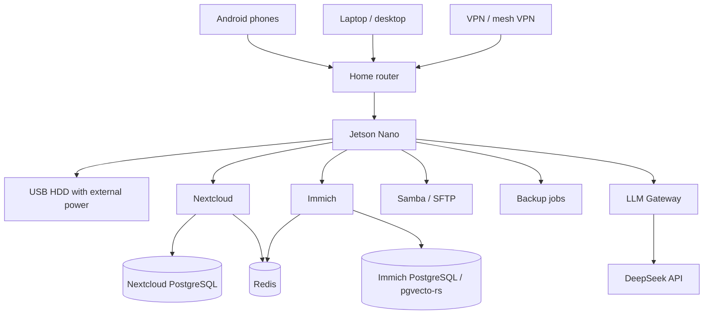

# Архитектура NASA Home Cloud

> Актуализировано: 2026-05-31.
>
> Этот файл является обзорной архитектурной картой проекта. Детальные
> инструкции живут в `docs/`, compose-шаблоны — в `docker/compose/`, код
> сервисов — в `services/`.

## 1. Назначение

NASA Home Cloud — домашняя семейная облачная платформа на базе **NVIDIA Jetson
Nano + USB HDD**. Проект предназначен для приватного хранения файлов,
документов, контактов, календарей, фото и видео с Android-устройств семьи.

Ключевая идея: Jetson Nano работает как маломощный домашний сервер хранения, а
не как узел тяжёлого ML/inference. На Stage 1 локальная LLM на Jetson не
разворачивается.

## 2. Логическая схема



## 3. Основные компоненты

| Компонент | Роль | Stage 1 статус |
|---|---|---|
| Jetson Nano | Домашний сервер приложений и storage-узел | целевая платформа |
| USB HDD | Основное хранилище `/mnt/storage` | требуется подготовка на железе |
| Nextcloud | Файлы, документы, WebDAV, Contacts/Calendar | compose-черновик есть |
| Immich | Фото- и видеоархив с Android | compose-черновик есть |
| Samba/SFTP | Локальный NAS-доступ | описано в архитектуре, реализация следующим шагом |
| PostgreSQL | Базы Nextcloud и Immich | используется в compose |
| Redis | Кэш/очереди для сервисов | используется в compose |
| LLM Gateway | Privacy-шлюз к DeepSeek API | FastAPI-скелет есть |
| Backup API | Будущий Android restore API | Stage 2 placeholder |
| restic | Резервное копирование файлов и дампов БД | script draft есть |

## 4. Сетевые правила

Stage 1 строится по принципу **LAN/VPN only**:

- Nextcloud доступен в LAN/VPN, порт `8080:80` в compose-шаблоне.
- Immich доступен в LAN/VPN, порт `2283:2283`.
- LLM Gateway доступен в LAN или локально, порт `8090:8090`.
- SSH/SFTP доступны только из LAN/VPN.
- Samba доступна только из LAN.
- Прямой публичный доступ из интернета не включается.

Отдельный reverse proxy с HTTPS внутри LAN/VPN возможен позже, но не является
обязательным первым шагом.

## 5. Хранилище

Целевой корень данных:

```text
/mnt/storage
├── nextcloud/data
├── immich/library
├── db/
│   ├── nextcloud-postgres
│   └── immich-postgres
├── backups/
│   ├── database-dumps
│   └── restic-repo
└── samba/
```

Актуальные переменные путей находятся в `config/.env.example`:

- `STORAGE_ROOT`
- `NEXTCLOUD_DATA`
- `NEXTCLOUD_DB_DATA`
- `IMMICH_UPLOAD_LOCATION`
- `IMMICH_DB_DATA_LOCATION`
- `BACKUP_ROOT`
- `RESTIC_REPOSITORY`

Подготовка диска, filesystem, mount и `fstab` описаны в
`docs/04_STORAGE_DESIGN.md`. Любое форматирование или изменение таблицы
разделов требует отдельного явного подтверждения пользователя.

## 6. Docker Compose

Актуальные compose-файлы:

| Файл | Назначение |
|---|---|
| `docker/compose/docker-compose.stage1.yml` | полный Stage 1 stack draft |
| `docker/compose/docker-compose.nextcloud.yml` | изолированный запуск Nextcloud |
| `docker/compose/docker-compose.immich.yml` | изолированный запуск Immich |
| `docker/compose/docker-compose.llm-gateway.yml` | изолированный запуск LLM Gateway |

Compose-файлы используют современную спецификацию Docker Compose с
верхнеуровневым ключом `name:`. Для проверки нужен Docker Compose v2:

```bash
docker compose -f docker/compose/docker-compose.stage1.yml --env-file config/.env config
```

Старый `docker-compose` v1 может отклонить эти файлы.

## 7. Nextcloud

Nextcloud отвечает за:

- файлы и документы;
- WebDAV;
- Contacts/Calendar;
- интеграцию с DAVx5 на Android;
- Android-клиент Nextcloud для файловых сценариев.

В текущем compose используется **PostgreSQL 16-alpine**, а не MariaDB:

- `nextcloud-db`: `postgres:16-alpine`;
- `nextcloud-redis`: `redis:7-alpine`;
- `nextcloud`: `nextcloud:apache`.

Детали: `docs/06_NEXTCLOUD_DESIGN.md`.

## 8. Immich

Immich отвечает за фото- и видеоархив с Android.

Ограничение Jetson Nano: начинать нужно с минимальной нагрузки. Machine learning
и тяжёлое видеотранскодирование нельзя включать до нагрузочных тестов.

В текущем compose используются:

- `immich-server`: `ghcr.io/immich-app/immich-server:${IMMICH_VERSION}`;
- `immich-db`: `tensorchord/pgvecto-rs:pg16-v0.3.0`;
- `immich-redis`: `redis:7-alpine`.

Отдельный технический долг: переменная
`IMMICH_DISABLE_MACHINE_LEARNING=true` есть в `config/.env.example`, но ещё не
передана в compose и должна быть реализована перед первым constrained-тестом на
Jetson.

Детали: `docs/07_IMMICH_DESIGN.md`.

## 9. LLM Gateway

LLM Gateway — единственная точка выхода к внешнему DeepSeek API.

Разрешено в Stage 1:

- анализировать обезличенную диагностику;
- объяснять ошибки Docker;
- помогать с runbook;
- работать с проектной документацией.

Запрещено отправлять во внешний LLM:

- фото и видео;
- контакты;
- календарь;
- личные документы;
- backup-архивы и backup-манифесты;
- токены, пароли, приватные ключи;
- полные логи с персональными данными.

Актуальные модели в шаблоне:

- `DEEPSEEK_MODEL=deepseek-v4-flash`
- `DEEPSEEK_REASONER_MODEL=deepseek-v4-pro`

Legacy-имена `deepseek-chat` и `deepseek-reasoner` оставлены только в
`config/llm-policy.yaml` как compatibility-секция.

Детали: `docs/08_LLM_GATEWAY_DEEPSEEK.md` и
`services/llm-gateway/README.md`.

## 10. Backup / Restore

Целевой подход:

1. Создать дампы БД Nextcloud и Immich.
2. Снять restic snapshot с пользовательских данных и дампов.
3. Проверить восстановление в отдельную тестовую директорию.
4. Только после restore-test считать backup рабочим.

Текущее состояние:

- `scripts/backup/backup_databases.sh` — placeholder, требует реализации после
  первого реального запуска контейнеров.
- `scripts/backup/restic_backup_example.sh` — пример restic workflow.
- `services/backup-api/` — Stage 2 placeholder для будущего Android restore,
  не production backup-сервис.

Детали: `docs/12_BACKUP_RESTORE.md`.

## 11. Android Stage 2

Stage 2 закладывает будущий Android-клиент восстановления. На Stage 1 он не
разворачивается как production-компонент.

Ограничение: обычное Android-приложение не заменит полностью системный backup
Google/Xiaomi без root/system privileges. Реалистичный MVP должен начинаться с
файлов, фото/видео, экспортируемых контактов/календаря и пользовательских
документов.

Детали: `docs/09_ANDROID_STAGE2_ARCHITECTURE.md` и
`services/backup-api/README.md`.

## 12. Актуальная структура проекта

```text
NASA/
├── README.md
├── AGENTS.md
├── PROJECT_CONTEXT.md
├── PROJECT_TREE.txt
├── SECURITY.md
├── CONTRIBUTING.md
├── AUDIT_2026-05-31.md
├── archtectura_nasa.md
├── config/
│   ├── .env.example
│   └── llm-policy.yaml
├── docker/
│   └── compose/
│       ├── docker-compose.stage1.yml
│       ├── docker-compose.nextcloud.yml
│       ├── docker-compose.immich.yml
│       └── docker-compose.llm-gateway.yml
├── docs/
│   ├── 00_OVERVIEW.md
│   ├── 01_HARDWARE_AUDIT.md
│   ├── 02_REQUIREMENTS.md
│   ├── 03_ARCHITECTURE.md
│   ├── 04_STORAGE_DESIGN.md
│   ├── 05_NETWORKING_VPN.md
│   ├── 06_NEXTCLOUD_DESIGN.md
│   ├── 07_IMMICH_DESIGN.md
│   ├── 08_LLM_GATEWAY_DEEPSEEK.md
│   ├── 09_ANDROID_STAGE2_ARCHITECTURE.md
│   ├── 10_SECURITY_PRIVACY.md
│   ├── 11_SECRETS_POLICY.md
│   ├── 12_BACKUP_RESTORE.md
│   ├── 13_MONITORING_RUNBOOK.md
│   ├── 14_TEST_PLAN.md
│   ├── 15_ALTERNATIVES_REVIEW.md
│   ├── 16_GITHUB_PUBLICATION.md
│   └── decisions/
│       └── ADR-0001-nextcloud-immich-deepseek.md
├── prompts/
│   ├── CODEX_BOOTSTRAP_PROMPT.md
│   ├── CODEX_HARDWARE_AUDIT_PROMPT.md
│   ├── CODEX_STORAGE_PROMPT.md
│   ├── CODEX_NEXTCLOUD_PROMPT.md
│   ├── CODEX_IMMICH_PROMPT.md
│   ├── CODEX_LLM_GATEWAY_PROMPT.md
│   ├── CODEX_SECURITY_PROMPT.md
│   └── CODEX_ANDROID_STAGE2_PROMPT.md
├── scripts/
│   ├── backup/
│   ├── diagnostics/
│   ├── maintenance/
│   └── security/
└── services/
    ├── llm-gateway/
    └── backup-api/
```

## 13. Карта документации

| Документ | Назначение |
|---|---|
| `README.md` | публичный двуязычный вход в проект |
| `PROJECT_CONTEXT.md` | назначение, решения и ограничения проекта |
| `AGENTS.md` | правила работы Codex/агентов |
| `AUDIT_2026-05-31.md` | аудит целостности перед первым запуском |
| `docs/00_OVERVIEW.md` | обзор концепции |
| `docs/01_HARDWARE_AUDIT.md` | аппаратный аудит Jetson |
| `docs/02_REQUIREMENTS.md` | требования к железу, ПО и сети |
| `docs/03_ARCHITECTURE.md` | компактная архитектурная схема |
| `docs/04_STORAGE_DESIGN.md` | дизайн HDD, mount и каталогов |
| `docs/05_NETWORKING_VPN.md` | LAN/VPN-модель |
| `docs/06_NEXTCLOUD_DESIGN.md` | дизайн Nextcloud |
| `docs/07_IMMICH_DESIGN.md` | дизайн Immich |
| `docs/08_LLM_GATEWAY_DEEPSEEK.md` | дизайн LLM Gateway |
| `docs/09_ANDROID_STAGE2_ARCHITECTURE.md` | будущий Android Stage 2 |
| `docs/10_SECURITY_PRIVACY.md` | безопасность и приватность |
| `docs/11_SECRETS_POLICY.md` | политика секретов |
| `docs/12_BACKUP_RESTORE.md` | backup/restore |
| `docs/13_MONITORING_RUNBOOK.md` | мониторинг и runbook |
| `docs/14_TEST_PLAN.md` | план тестирования |
| `docs/15_ALTERNATIVES_REVIEW.md` | обзор альтернатив |
| `docs/16_GITHUB_PUBLICATION.md` | публикация на GitHub |

## 14. Этапы реализации

| Этап | Содержание | Контроль результата |
|---|---|---|
| Stage 1A | hardware audit, storage, Samba/SFTP | отчёт аудита, mount, тест записи |
| Stage 1B | Nextcloud | web login, файл, WebDAV, Android client |
| Stage 1C | Immich | 20-50 фото, 2-3 видео, `docker stats` |
| Stage 1D | LLM Gateway | `/health`, `/v1/redact`, mock/DeepSeek safe test |
| Stage 1E | Backup/restore | snapshot и restore-test |
| Stage 2 | Android backup/restore API/client | отдельный RFC и MVP |
| Stage 3 | расширенная аналитика/RAG/fallback providers | после стабилизации Stage 1 |

## 15. Известные технические долги

- Docker Compose требует v2; `docker-compose` v1 может не подходить.
- `IMMICH_DISABLE_MACHINE_LEARNING` нужно связать с compose.
- `backup_databases.sh` пока placeholder.
- `config/llm-policy.yaml` описывает целевую политику, но лимиты ещё не все
  реализованы в коде LLM Gateway.
- `POSTGRES_NEXTCLOUD_PASSWORD` дублирует `NEXTCLOUD_DB_PASSWORD` и не
  используется.
- Reverse proxy для HTTPS внутри LAN/VPN ещё не реализован.

## 16. Первый практический шаг

Перед развёртыванием сервисов нужно выполнить диагностику на целевом Jetson:

```bash
./scripts/diagnostics/hardware_audit.sh
./scripts/diagnostics/storage_health.sh /dev/sda
```

После аудита принимается решение по подготовке HDD, `fstab`, структуре
`/mnt/storage` и только затем запускаются сервисы.
