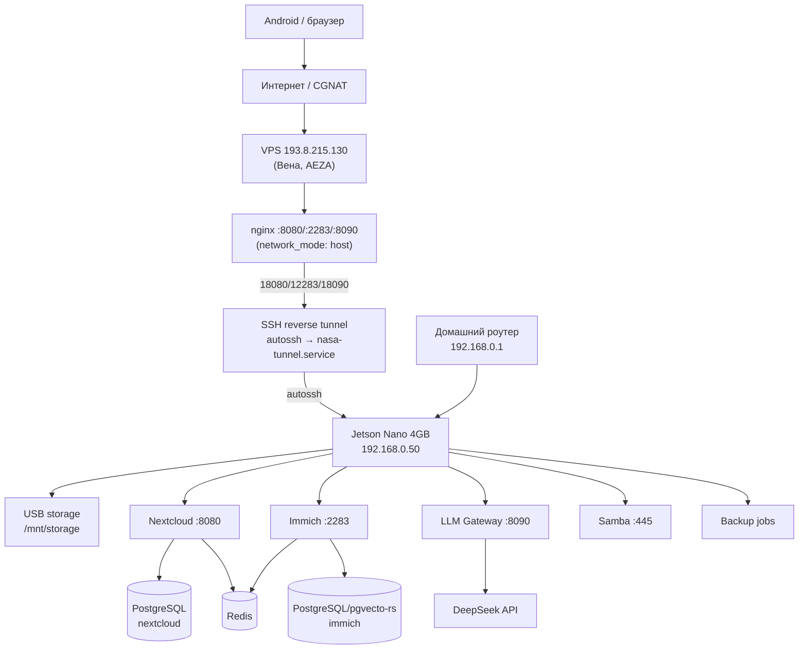

# Архитектура NASA Home Cloud

> Актуализировано: 2026-06-23.
>
> Этот файл является обзорной архитектурной картой проекта. Детальные
> инструкции живут в `docs/`, compose-шаблоны — в `docker/compose/`, код
> сервисов — в `services/`.

## 1. Назначение

NASA Home Cloud — домашняя семейная облачная платформа на базе **NVIDIA Jetson
Nano 4 GB + USB SSD/HDD**. Проект предназначен для приватного хранения файлов,
документов, фото и видео с Android-устройств семьи без зависимости от
Google/Xiaomi Cloud.

Ключевая идея: Jetson Nano работает как маломощный домашний сервер хранения, а
не как узел тяжёлого ML/inference. Локальная LLM на Jetson не разворачивается —
вместо неё используется privacy-шлюз к DeepSeek API. Доступ снаружи без белого
IP обеспечивается через обратный SSH-тоннель к VPS (обход CGNAT).

## 2. Логическая схема



## 3. Основные компоненты

| Компонент | Роль | Статус (2026-06-21) |
|---|---|---|
| Jetson Nano 4 GB | Домашний сервер, storage-узел | ✅ Работает в LAN |
| USB storage | Основное хранилище `/mnt/storage` | ⚠️ Incident 2026-06-23: not mounted, `error -71` |
| Nextcloud | Файлы, WebDAV, Contacts/Calendar | ⚠️ Degraded, HTTP 503 until storage restored |
| Immich | Фото- и видеоархив | ✅ Live, HTTP 200 |
| Samba | Локальный NAS (SMB2+) | ⚠️ Storage-dependent |
| PostgreSQL | БД Nextcloud и Immich | ✅ Running |
| Redis | Кэш/очереди для Nextcloud и Immich | ✅ Running |
| LLM Gateway | Privacy-шлюз к DeepSeek API | ✅ Live, /health 200 |
| VPS + nginx | Reverse proxy через тоннель | ✅ Live |
| autossh tunnel | Обход CGNAT, Jetson → VPS | ✅ nasa-tunnel.service active |
| Backup API | Будущий Android restore API | 📋 Stage 2 placeholder |
| DB backup | pg_dump timer | ⚠️ Fail-closed while storage preflight fails |
| Monitoring | Netdata + Uptime Kuma + Portainer | ✅ Live |

## 4. Сетевые правила

| Сервис | Порт Jetson | Внешний доступ | Механизм |
|---|---|---|---|
| Nextcloud | 8080 | `http://193.8.215.130:8080/` | VPS nginx → SSH tunnel; degraded until storage restored |
| Immich | 2283 | `http://193.8.215.130:2283/` | VPS nginx → SSH tunnel |
| LLM Gateway | 8090 | `http://193.8.215.130:8090/` | VPS nginx → SSH tunnel |
| SSH (управление) | 22 | `ssh -p 10022 admin@127.0.0.1` с VPS | SSH tunnel -R 10022 |
| Samba | 445/139 | LAN only (192.168.0.0/24) | iptables + netfilter-persistent |

Прямого проброса портов на роутере нет. Jetson не получает белый IP (CGNAT).

## 5. Хранилище

```text
/mnt/storage                     ← target USB storage, ext4 (incident 2026-06-23: not mounted)
├── nextcloud/data                ← bind mount → /var/www/html/data
├── immich/library                ← Immich photo uploads
├── db/
│   ├── nextcloud-postgres        ← bind mount → postgres container
│   └── immich-postgres           ← bind mount → postgres container
├── backups/
│   ├── database-dumps            ← pg_dump output
│   └── restic-repo               ← restic snapshots
└── samba/public                  ← Samba public share
```

Актуальные переменные путей — в `config/.env.example`:
`STORAGE_ROOT`, `NEXTCLOUD_DATA`, `NEXTCLOUD_DB_DATA`,
`IMMICH_UPLOAD_LOCATION`, `IMMICH_DB_DATA_LOCATION`, `BACKUP_ROOT`.

## 6. Docker Compose файлы

| Файл | Назначение | Статус |
|---|---|---|
| `docker/compose/docker-compose.nextcloud.yml` | Nextcloud + PostgreSQL + Redis | ✅ Running |
| `docker/compose/docker-compose.immich.yml` | Immich + PostgreSQL + Redis | ✅ Running |
| `docker/compose/docker-compose.llm-gateway.yml` | LLM Gateway (FastAPI) | ✅ Running |
| `docker/compose/docker-compose.samba.yml` | Samba NAS (ARM64, SMB2+) | ⚠️ Storage-dependent |
| `docker/compose/docker-compose.monitoring.yml` | Netdata + Uptime Kuma + Portainer | ✅ Running |
| `docker/compose/docker-compose.stage1.yml` | Полный Stage 1 stack draft | draft |
| `docker/vps/docker-compose.yml` | nginx на VPS (`network_mode: host`) | ✅ Running on VPS |

> **Важно:** `docker-compose.nextcloud.yml` и `docker-compose.stage1.yml` используют
> одинаковые имена контейнеров — запускать только один из них.

## 7. Nextcloud

- PostgreSQL 16-alpine (`nextcloud-db`)
- Redis 7-alpine (`nextcloud-redis`)
- `nextcloud:apache` (latest)
- Установлен через `occ maintenance:install` (не через веб-форму)
- trusted_domains: `192.168.0.50`, `localhost`, `127.0.0.1`, `193.8.215.130`
- data dir: `/mnt/storage/nextcloud/data` (bind mount → `/var/www/html/data`)

Детали: [docs/06_NEXTCLOUD_DESIGN.md](docs/06_NEXTCLOUD_DESIGN.md).

## 8. Immich

- `ghcr.io/immich-app/immich-server:release`
- `tensorchord/pgvecto-rs:pg16-v0.3.0` (Immich DB)
- Redis 7-alpine
- `IMMICH_DISABLE_MACHINE_LEARNING=true` — обязательно для Jetson Nano 4 GB

Детали: [docs/07_IMMICH_DESIGN.md](docs/07_IMMICH_DESIGN.md).

## 9. LLM Gateway

FastAPI-сервис — единственная точка выхода к DeepSeek API.

Разрешено в Stage 1:
- анализировать обезличенную диагностику
- объяснять ошибки Docker
- работать с проектной документацией

Запрещено отправлять:
- фото, видео, контакты, календарь
- личные документы и backup-архивы
- токены, пароли, приватные ключи

Endpoints: `GET /health`, `POST /v1/chat`, `POST /v1/redact`, `POST /v1/diagnostics/explain`.  
Swagger UI: `http://192.168.0.50:8090/docs`.

Модели: `DEEPSEEK_MODEL=deepseek-chat`, `DEEPSEEK_REASONER_MODEL=deepseek-reasoner`.

Детали: [docs/08_LLM_GATEWAY_DEEPSEEK.md](docs/08_LLM_GATEWAY_DEEPSEEK.md).

## 10. VPS + autossh тоннель

Обратный SSH-тоннель обходит CGNAT:

```
Jetson:        autossh -R 18080:localhost:8080 -R 12283:localhost:2283
                        -R 18090:localhost:8090 -R 10022:localhost:22
                        root@193.8.215.130
VPS sshd:      127.0.0.1:18080 → tunnel → Jetson:8080
VPS nginx:     :8080 → 127.0.0.1:18080   (network_mode: host!)
```

Критичный параметр: nginx запущен с `network_mode: host` — в bridge-режиме
`127.0.0.1:18080` внутри контейнера не совпадает с loopback хоста, где сидит тоннель.

systemd: `nasa-tunnel.service` (enabled, автозапуск при загрузке Jetson).

ADR: [docs/decisions/ADR-0005-vps-autossh-reverse-tunnel.md](docs/decisions/ADR-0005-vps-autossh-reverse-tunnel.md).

## 11. Backup / Restore

Целевой подход:
1. `pg_dump` → `/mnt/storage/backups/database-dumps/`
2. restic snapshot с данными и дампами
3. Restore-test в `/tmp/restore-test`

Текущее состояние: `scripts/backup/backup_databases.sh` реализован и работает
fail-closed: если `/mnt/storage` не смонтирован безопасно, дампы не создаются.

Детали: [docs/12_BACKUP_RESTORE.md](docs/12_BACKUP_RESTORE.md).

## 12. Android Stage 2

Future: Android-клиент восстановления через `services/backup-api/`.  
На Stage 1 не разворачивается.

## 13. Этапы реализации

| Этап | Содержание | Статус |
|---|---|---|
| Stage 0 | microSD, first boot, SSH | ✅ Задокументировано |
| Stage 1A | Hardware audit, storage, Samba | ⚠️ USB storage incident |
| Stage 1B | Nextcloud | ⚠️ **Degraded until `/mnt/storage` is restored** |
| Stage 1C | Immich (ML disabled) | ✅ **Live** |
| Stage 1D | LLM Gateway + DeepSeek | ✅ **Live** |
| Stage 1E | VPS + reverse SSH tunnel | ✅ **Live** |
| Stage 1F | Мониторинг (Netdata, Uptime Kuma, Portainer) | ✅ Live |
| Stage 1G | Backup/restore | ⚠️ DB dumps fail-closed while storage is missing |
| Stage 2 | Android backup/restore API | 📋 Архитектура |
| Stage 3 | RAG, fallback LLM providers | 📋 Будущее |

## 14. Структура проекта

```text
NASA/
├── README.md
├── AGENTS.md
├── PROJECT_CONTEXT.md
├── archtectura_nasa.md
├── config/
│   ├── .env.example
│   └── llm-policy.yaml
├── docker/
│   ├── compose/
│   │   ├── docker-compose.stage1.yml
│   │   ├── docker-compose.nextcloud.yml
│   │   ├── docker-compose.immich.yml
│   │   ├── docker-compose.llm-gateway.yml
│   │   ├── docker-compose.samba.yml
│   │   └── docker-compose.monitoring.yml
│   └── vps/
│       ├── docker-compose.yml          ← nginx (network_mode: host)
│       └── nginx/conf.d/
├── docs/
│   ├── 03_ARCHITECTURE.md
│   ├── 05_NETWORKING_VPN.md
│   ├── decisions/
│   │   ├── ADR-0004-tailscale-external-access.md   ← Superseded
│   │   └── ADR-0005-vps-autossh-reverse-tunnel.md  ← Implemented
│   └── plans/
│       └── VPS_INTEGRATION_PLAN.md                 ← Завершено
├── prompts/
│   ├── CODEX_CODE_AGENT.md
│   ├── CODEX_HARDWARE_AGENT.md
│   ├── CODEX_DOCS_AGENT.md
│   ├── CODEX_NETWORK_AGENT.md
│   └── CODEX_SYSAPPS_AGENT.md
├── scripts/
│   ├── backup/
│   ├── diagnostics/
│   ├── network/
│   │   └── setup_vps_tunnel.sh
│   ├── maintenance/
│   └── security/
├── services/
│   ├── llm-gateway/app/main.py
│   └── backup-api/
└── systemd/
    ├── nasa-tunnel.service             ← autossh, enabled
    └── jetson-nas-health.service
```

## 15. Известные технические долги

- USB storage incident 2026-06-23: Realtek RTL9210B-CG / 250 GB device gives
  `error -71` and is absent from `lsblk`; see `docs/plans/STORAGE_INCIDENT_2026-06-23.md`.
- Storage-backed services must pass `sudo bash scripts/storage/storage_preflight.sh`
  before Nextcloud/Immich/backup operations.
- HTTPS для VPS nginx не настроен (Let's Encrypt — будущее улучшение).
- `services/backup-api` — Stage 2, не production.
