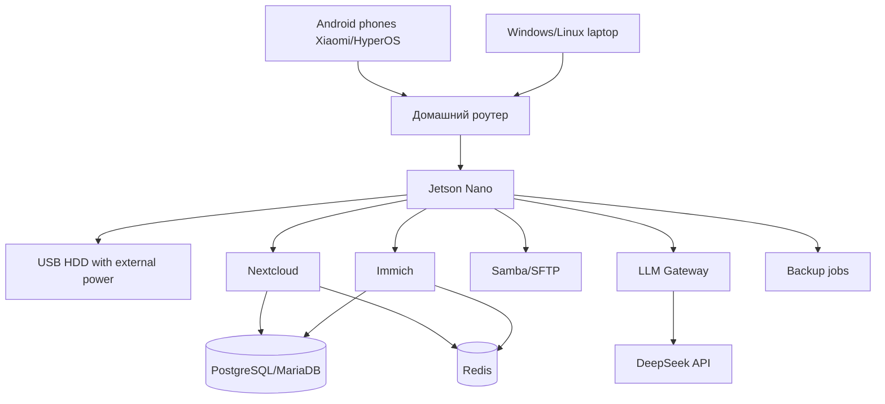

# 03. Архитектура

## 1. Логическая схема

## 2. Слои

| Слой | Назначение |
|---|---|
| Storage | USB HDD, ext4, `/mnt/storage` |
| NAS | Samba/SFTP |
| Cloud | Nextcloud |
| Photo archive | Immich |
| Databases | PostgreSQL/MariaDB, Redis |
| AI | LLM Gateway → DeepSeek API |
| Backup | DB dumps + restic/borg |
| Future Android | Backup API + Android client |

## 3. Порты

| Сервис | Внутренний порт | Внешний доступ |
|---|---:|---|
| Nextcloud | 8080/80 | LAN/VPN only |
| Immich | 2283 | LAN/VPN only |
| LLM Gateway | 8090 | LAN only, опционально localhost |
| SSH/SFTP | 22 | LAN/VPN only |
| Samba | 445 | LAN only |

## 4. Принцип изоляции LLM

LLM Gateway получает только:

- обезличенные логи;
- статусы сервисов;
- фрагменты проектной документации;
- результаты диагностики без секретов.

LLM Gateway не получает:

- фото;
- видео;
- контакты;
- календарь;
- личные документы;
- ключи;
- полные backup-архивы.

## 5. Этапы

| Этап | Содержание |
|---|---|
| Stage 1A | Hardware audit, storage, Samba/SFTP |
| Stage 1B | Nextcloud |
| Stage 1C | Immich в ограниченном режиме |
| Stage 1D | DeepSeek LLM Gateway |
| Stage 1E | Backup/restore |
| Stage 2 | Android-клиент восстановления |
| Stage 3 | Расширенная аналитика, RAG, альтернативные LLM-провайдеры |
