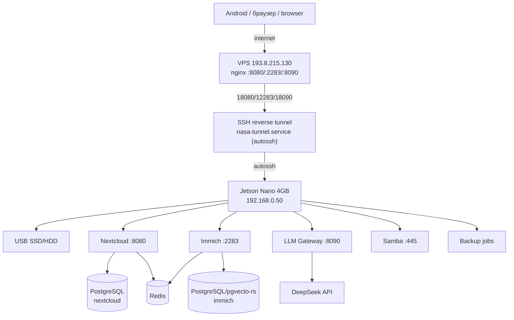

# 03. Архитектура / Architecture

> 🇷🇺 Актуализировано: 2026-06-27. Полная карта — [architecture_nasa.md](../docs/architecture_nasa.md).
> 🇬🇧 Updated: 2026-06-27. Full map — [architecture_nasa.md](../docs/architecture_nasa.md).

## 1. Логическая схема / Logical Diagram



## 2. Слои / Layers

| Слой / Layer | Назначение / Purpose |
|---|---|
| External relay | VPS nginx (host network) + SSH reverse tunnel via CGNAT / через CGNAT |
| Storage | USB SSD/HDD, ext4, `/mnt/storage`; preflight required before storage-backed services |
| NAS | Samba/SMB2+ (LAN only) |
| Cloud | Nextcloud |
| Photo archive | Immich |
| Databases | PostgreSQL 16 (Nextcloud + Immich/pgvecto-rs), Redis 7 |
| AI | LLM Gateway → DeepSeek API (privacy-filtered / с редакцией персданных) |
| Backup | pg_dump + restic |
| Future Android | Backup API + Android client (Stage 2) |

## 3. Порты / Ports

| Сервис / Service | Порт Jetson / Jetson Port | Внешний доступ / External access | Статус / Status |
|---|---|---|---|
| Nextcloud | 8080 | `http://193.8.215.130:8080/` | ✅ Live |
| Immich | 2283 | `http://193.8.215.130:2283/` | ✅ Live |
| LLM Gateway | 8090 | `http://193.8.215.130:8090/` | ✅ Live |
| SSH управление / management | 22 | `ssh -p 10022 admin@127.0.0.1` from VPS | ✅ tunnel |
| Samba | 445/139 | LAN only (192.168.0.0/24) | ✅ Live |

🇷🇺 Прямого проброса портов на домашнем роутере нет.
🇬🇧 No direct port forwarding on the home router.

## 4. VPS + reverse SSH tunnel

🇷🇺 Обход CGNAT через исходящий SSH от Jetson:
🇬🇧 CGNAT bypass via outgoing SSH from Jetson:

```
Jetson → autossh -R 18080:localhost:8080
                 -R 12283:localhost:2283
                 -R 18090:localhost:8090
                 -R 10022:localhost:22
                 root@193.8.215.130
```

🇷🇺 VPS nginx (`network_mode: host`) проксирует публичные порты на `127.0.0.1:18xxx`.
🇬🇧 VPS nginx (`network_mode: host`) proxies public ports to `127.0.0.1:18xxx`.

Details / Подробнее: [docs/decisions/ADR-0005-vps-autossh-reverse-tunnel.md](decisions/ADR-0005-vps-autossh-reverse-tunnel.md).

## 5. Принцип изоляции LLM / LLM Isolation Principle

🇷🇺 LLM Gateway получает только:
🇬🇧 LLM Gateway receives only:

- обезличенные логи и статусы сервисов / anonymized logs and service statuses
- фрагменты проектной документации / project documentation excerpts
- результаты диагностики без секретов / diagnostics results without secrets

🇷🇺 LLM Gateway **не получает**: фото, видео, контакты, календарь, личные документы, ключи, backup-архивы.
🇬🇧 LLM Gateway **does not receive**: photos, videos, contacts, calendars, personal documents, keys, or backup archives.

## 6. Этапы / Stages

| Этап / Stage | Содержание / Content | Статус / Status |
|---|---|---|
| Stage 0 | microSD, first boot, SSH | ✅ |
| Stage 1A | Hardware audit, storage, Samba | ✅ Storage recovered; boot guard added |
| Stage 1B | Nextcloud | ✅ Recovered; DB/Redis healthy |
| Stage 1C | Immich (ML disabled) | ✅ Live |
| Stage 1D | LLM Gateway + DeepSeek | ✅ Live |
| Stage 1E | VPS + reverse SSH tunnel | ✅ Live |
| Stage 1F | Monitoring | ✅ Live |
| Stage 1G | Backup/restore | ✅ DB dumps working; fail-closed guard |
| Stage 2 | Android backup API | 📋 Planned |
| Stage 3 | RAG, fallback LLM | 📋 Planned |
