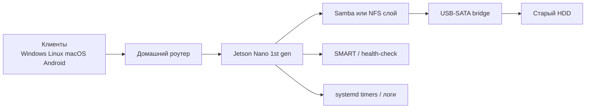

# Аналитический отчет по NAS-проектам / NAS & File-server Research Report for Jetson Nano and SBCs

> 🇷🇺 Аналитический обзор open-source проектов NAS и файловых серверов для Jetson Nano и одноплатных ПК. Документ обосновывает выбор архитектурного подхода.
>
> 🇬🇧 Analytical review of open-source NAS and file-server projects for Jetson Nano and single-board computers. The document justifies the chosen architectural approach.

## Executive summary / Резюме

Для проекта NAS на базе **Jetson Nano первого поколения + старый HDD** существует реалистичная и технически оправданная ниша: не как «еще один NAS-дистрибутив», а как **воспроизводимый инженерный DIY-проект по продлению жизни старого оборудования** с прозрачной автоматизацией, диагностикой и минимальным стеком. В изученных источниках Jetson Nano почти никогда не используется с полноценным NAS-OS; практические сборки чаще строятся вокруг **стандартного Ubuntu/L4T, внешнего USB-накопителя и Samba**, тогда как более зрелые SBC-ориентированные решения реализованы на Raspberry Pi / Armbian / Debian в виде OpenMediaVault, NextcloudPi, RetroNAS, NasberryPi и контейнерных Samba-образов. Это означает, что ваш проект может привлечь внимание именно как **узко сфокусированная, аккуратно документированная Jetson-сборка**, а не как клон существующего продукта. citeturn39search0turn39search1turn17search0turn29search0turn25view0turn11view0

С инженерной точки зрения для Jetson Nano оптимален не тяжелый комбайн, а **тонкий слой автоматизации** поверх базовой ОС: загрузка rootfs с USB-диска по PARTUUID, строгое монтирование одного накопителя, минимальный Samba-конфиг, SMART/health-check на хосте, systemd timer для диагностики, журналирование и понятный recovery path. Именно такие элементы лучше всего переиспользуются из рассмотренных проектов. Наиболее ценные паттерны: **USB-root и extlinux/PARTUUID** из JetsonHacks, **аппаратный режим “Public-only appliance mode” и preflight/repair** из NasberryPi, **SMART + mail + snapshot/backup discipline** из OMV и NextcloudPi, а также **container-only SMB с YAML-конфигом** из crazy-max/docker-samba для альтернативного варианта развертывания. citeturn8view0turn8view2turn28view0turn28view1turn32search5turn32search6turn17search0turn37search0

С точки зрения «раскрутки» на GitHub этот класс проектов интересен аудитории homelab / self-hosting / retro-hardware / sustainability, но внимание обычно получают не общие слова про reuse, а **строго оформленные артефакты**: BOM, схемы питания, скрипты one-command setup, health dashboard, тесты, метрики, фото/видео, честные ограничения и бенчмарки. В reviewed-среде заметен интерес к SBC-NAS как к DIY-направлению и к репликации небольших, прозрачных сборок, особенно если они хорошо воспроизводимы. citeturn40search0turn40search1turn24reddit12turn40reddit52

## Методика и рамки исследования

Исследование выполнялось по первичным и максимально близким к первичным источникам: репозитории и документация **GitHub**, официальные docs/форумы проектов, а также обзорные и контекстные источники из **JetsonHacks**, **Hackaday/Hackaday.io**, **Reddit** и релевантных блогов. В shortlist включались проекты, где одновременно были доступны: исходный код или конфигурации, признаки эксплуатации на SBC/ARM, практическая схема хранения на внешнем диске и достаточная детализация для воспроизведения. citeturn39search0turn17search0turn29search0turn25view0turn11view0turn34view0turn40search0turn24reddit12

Для столбца «год» ниже использован **первый верифицируемый год, видимый в просмотренном источнике**; если он не подтверждался напрямую, указано `н/д`. Для столбца «активность» указан **последний наблюдаемый коммит/апдейт в просмотренном источнике**, а не обязательно глобально последний коммит по всему репозиторию. Это важно, потому что часть web-представлений GitHub показывала историю отдельных файлов, а не полный граф коммитов. citeturn33view0turn42view0turn43view0turn43view1turn43view2turn24search2

В качестве русскоязычного контекста дополнительно учитывались материалы Habr и Habr Q&A по Jetson Nano, NextcloudPi и эксплуатации Raspberry Pi/OMV как домашнего NAS. Они использовались не как основа для технических выводов, а как индикатор практических проблем и интереса русскоязычной аудитории. citeturn41search3turn41search4turn41search8turn41search0



## Сводная таблица обнаруженных проектов

| Проект | URL / источник | Автор / организация | Год | Аппаратная база | Интерфейс хранения | ОС / дистрибутив | Основные функции | Лицензия | Последняя наблюдаемая активность |
|---|---|---|---|---|---|---|---|---|---|
| JetsonHacks bootFromUSB | `jetsonhacks/bootFromUSB` citeturn7view1 | JetsonHacks / Jim Benson | 2021 citeturn39search0turn33view0 | Jetson Nano dev kit A02/B01/2GB citeturn39search0 | USB rootfs, PARTUUID, extlinux citeturn8view0turn8view2 | JetPack 4.5+ / L4T 32.5+ citeturn39search0 | Загрузка с USB, перенос rootfs, extlinux automation | MIT (по репо) citeturn7view1 | 2021-05-16 citeturn33view0 |
| openmediavault | `openmediavault/openmediavault` citeturn29search0 | Volker Theile / OMV | 2009 citeturn30view0 | x86/ARM, SBC через Debian/Armbian citeturn32search2turn32search4 | USB-SATA, SATA HAT, штатные ФС Linux/BTRFS citeturn32search1turn32search6 | Debian, Armbian, SBC ARM64/AMD64 citeturn31view3turn32search2 | SMB/CIFS, NFS, rsync, SMART, snapshots, web UI | GPL-3.0 family citeturn29search0turn30view0 | 2026-05-02 по `install.sh` citeturn43view2 |
| NextcloudPi | `nextcloud/nextcloudpi` citeturn16view0 | Nextcloud community | 2017 citeturn22view0turn23view2 | Raspberry Pi, Odroid HC1, Rock64, др. ARM boards citeturn16view0 | USB automount, BTRFS, external data dir citeturn17search0turn21search1 | Raspberry Pi OS / Debian 12 / Armbian builds citeturn16view0turn22view0 | Web cloud, Samba, NFS, backup/restore, BTRFS snapshots, SMART, UFW, Fail2Ban | GPL family / community project citeturn16view0turn22view0 | 2025-11-19 citeturn42view0 |
| RetroNAS | `retronas/retronas` citeturn11view0 | retronas org | н/д | Raspberry Pi, old computer, VM citeturn11view0turn12search2 | Внешние HDD/крупные диски, 64-bit рекомендован для very large hard drives citeturn12search2 | Debian 13 / Raspberry Pi OS based on Debian 13 citeturn12search2 | Samba, NFS и legacy-совместимость, install menu, service checks | MIT citeturn11view0 | 2026-05-06 (наблюдаемое обновление org/repo) citeturn24search2 |
| NasberryPi | `WastelandSYS/nasberrypi` citeturn25view0 | WastelandSYS | 2026 citeturn24reddit12turn43view0 | Raspberry Pi 4B/5/Zero 2W и Debian-family Linux citeturn25view0turn43view0 | USB SSD/HDD/flash drive citeturn25view0 | Debian, Raspberry Pi OS, Ubuntu, Kali Linux (apt-get family) citeturn25view0turn26view0 | Guided setup, Samba, diagnostics, Panic Lock, Safe Mode | GPL-3.0 citeturn25view0 | 2026-06-17 citeturn43view0 |
| docker-samba | `crazy-max/docker-samba` citeturn34view0 | crazy-max | н/д | Любой host c Docker, включая arm64 SBC citeturn37search0 | Host-mounted volumes, обычно USB-SATA на хосте citeturn37search0 | Docker host on Linux, multi-arch image citeturn37search0 | Samba, YAML config, Avahi/WSDD2, modern-only SMB, container deployment | MIT citeturn34view0 | 2026-06-19 citeturn43view1 |

## Анализ проектов и извлекаемые паттерны

### JetsonHacks bootFromUSB

Это не полноценный NAS-проект, а **критически важный Jetson-специфичный фундамент**. Для Jetson Nano он решает главную практическую проблему: перенос корневой файловой системы с microSD на USB-накопитель, что одновременно повышает надежность и упрощает сценарий «старый HDD как постоянное хранилище». JetsonHacks прямо пишет, что с JetPack 4.5+ Nano может загружаться с USB, и подчеркивает более высокую надежность и скорость USB по сравнению с microSD. В другой статье JetsonHacks приводит ориентир: microSD около **87 MB/s**, SSD около **367 MB/s**, а HDD по скорости близок к microSD, но обычно надежнее в долгосрочной эксплуатации. citeturn39search0turn39search1

**Ключевые файлы и роль**

| Файл | Назначение | Доказательство |
|---|---|---|
| `copyRootToUSB.sh` | Копирование rootfs на USB | citeturn7view1turn8view1 |
| `partUUID.sh` | Получение PARTUUID для `extlinux.conf` | citeturn7view1turn8view2 |
| `sample-extlinux.conf` | Шаблон extlinux для загрузки с USB | citeturn7view1turn8view0 |
| `README.md` | Пошаговая процедура и ограничения | citeturn7view1turn39search0 |

**Короткие извлеченные фрагменты**

- `sample-extlinux.conf`, строка 1: `TIMEOUT 30` — есть явный загрузочный таймаут. citeturn8view0
- `sample-extlinux.conf`, строки 6–7: `root=PARTUUID=<part-uuid>` — основа стабильного rootfs без зависимости от `/dev/sdX`. citeturn8view0
- `copyRootToUSB.sh`, строка 17: `sudo rsync -axHAWX --numeric-ids` — корректное копирование rootfs со служебными атрибутами. citeturn8view1
- `partUUID.sh`, строка 13: `lsblk -n -o PARTUUID` — автоматизация извлечения PARTUUID. citeturn8view2

**Шаги установки в просмотренных источниках**

`git clone`, затем `./partUUID.sh`, ручная правка `extlinux.conf`, после чего выключение, извлечение SD-карты и тестовая загрузка с USB. Для JetPack 4.5+ требуется первичная настройка, чтобы прошивка была перенесена в QSPI-NOR. USB-диск должен быть подключен до старта, hot-swap не предполагается. citeturn39search0turn8view0turn8view2

**Ограничения и обращение с HDD**

Проект **не занимается файловым сервисом, SMART, бэкапами и защитой доступа**; он только готовит устойчивую USB-базу. Для Jetson Nano это ценно: именно этот слой стоит переиспользовать в полном объеме. Ограничения тоже нужно честно наследовать: общий USB bandwidth на Nano делится между всеми портами, а HDD должен получать стабильное питание и не может считаться hot-swappable boot device. citeturn39search0turn39search1

### openmediavault

OMV — наиболее зрелая полноценная NAS-платформа из shortlist. Проект прямо позиционируется как next-generation NAS на Debian с SSH, FTP, SMB/CIFS, rsync и плагинной архитектурой. Для ARM/SBC официальный путь — сначала Debian/Armbian, затем установка OMV; документация отдельно отмечает, что на ARM-устройствах следует использовать подходящий образ Armbian, а для SBC-систем архитектуры ARM32/64 предназначен вариант установки поверх Debian OS. citeturn29search0turn32search2turn32search4

**Ключевые файлы и роль**

| Файл / конфиг | Назначение | Доказательство |
|---|---|---|
| `install.sh` | Bootstrap установки OMV на Debian | citeturn30view0turn31view3 |
| `/etc/apt/sources.list.d/openmediavault.list` | Репозитории OMV | citeturn31view0turn31view3 |
| `/etc/samba/smb.conf` | Генерируемая Samba-конфигурация OMV | citeturn32search5turn29search4 |
| internal `config.xml` / shared-folder DB | Привязка share UUID к storage entities | citeturn32search1 |

**Короткие извлеченные фрагменты**

- `install.sh`, строки 668–669: `amd64|arm64)` — явная поддержка ARM64 в bootstrap-скрипте. citeturn31view3
- `install.sh`, строка 753: `install openmediavault` — финальная установка пакета. citeturn31view0
- `install.sh`, строка 757: `omv-confdbadm populate` — заполнение внутренней БД после установки. citeturn31view0
- `install.sh`, строка 764: `omv-salt deploy run hosts` — post-install deploy через Salt. citeturn31view3
- Пример Samba-share в docs: `path = /media//dev/disk/by-label/VOLUME1/Documents/` — OMV строит shares вокруг managed shared folders. citeturn32search5

**Шаги установки в просмотренных источниках**

Базовый путь таков: minimal Debian/Armbian, без desktop environment, затем запуск root-команды установки или использование `armbian-config` на ARM. Документация отдельно предупреждает, что OMV берет на себя полный контроль над managed services и не предназначен для сосуществования с обычной desktop-средой. citeturn29search0turn32search2turn32search4

**Ограничения и обращение с HDD**

OMV хорошо закрывает эксплуатационный контур: SMART через smartmontools с почтовыми уведомлениями, shared folders как ядро модели данных, BTRFS snapshots и shadow copies для Windows. Но именно для Jetson Nano это, как правило, **избыточный и тяжелый слой**, особенно если цель — компактный публичный GitHub-проект с низким порогом воспроизводимости. Кроме того, на USB-SATA-мостах возможны нюансы SMART device type; issue по SSD/USB-мостам показывает, что иногда нужны специальные типы вроде `-d sntasmedia`. citeturn32search1turn32search5turn32search6turn29search5

### NextcloudPi

NextcloudPi — более «облачный» вариант, чем классический NAS, но он особенно полезен как источник зрелых шаблонов для **backup/restore, snapshots, SMART, firewall и remote administration** на ARM-платах. В README заявлены готовые образы для Raspberry Pi, Odroid HC1, Rock64 и других boards, а также поддержка Raspberry Pi OS/Debian 12, `ncp-config`, SMB, NFS, USB automount, SMART monitoring, scheduled rsync, BTRFS snapshots, UFW и Fail2Ban. citeturn16view0turn17search0

**Ключевые файлы и роль**

| Файл | Назначение | Доказательство |
|---|---|---|
| `build/build-SD-rpi.sh` | Сборка ARM-образа для Raspberry Pi | citeturn22view0 |
| `install.sh` | Установка на Debian-based host | citeturn16view0turn22view1 |
| `ncp.sh` | Основной bootstrap / web-panel / helper launchers | citeturn22view2turn23view2 |
| `post-inst.sh` | Post-install hook | citeturn22view3 |

**Короткие извлеченные фрагменты**

- `build/build-SD-rpi.sh`, строка 493: `#!/bin/bash` — полноценный build-script, а не только docs. citeturn22view0
- `build/build-SD-rpi.sh`, строка 511: `source build/buildlib.sh` — build собран модульно. citeturn22view0
- `ncp.sh`, строки 905–907: `CONFDIR=/usr/local/etc/ncp-config.d/` и `APTINSTALL="apt-get install -y --no-install-recommends"` — отдельный каталог конфигов и controlled apt-install. citeturn23view2
- `ncp.sh`, строки 940–946: shortcut `ncc` вызывает `php /var/www/nextcloud/occ`. citeturn23view2
- `ncp.sh`, строки 955–965: создается `ncp-activation.conf` для Apache/web-panel. citeturn23view2

**Шаги установки в просмотренных источниках**

Поддерживаются: сборка SD-образа для Raspberry Pi, сборка для Armbian-bases, LXD-вариант и curl-install для Debian-based host. Для Proxmox отдельно поддерживается LXC-образ. На практике это один из самых автоматизированных проектов в обзоре. citeturn16view0turn17search0turn22view0

**Ограничения и обращение с HDD**

Для Jetson Nano проект избыточен, если задача — именно NAS/file-server, а не self-hosted cloud. При этом он ценен как reference design для workhorse-функций. В issue по `nc-datadir` видно, что смена data directory на внешнее хранилище может быть чувствительна к состоянию каталога и временных файлов; это хороший аргумент в пользу максимально простого layout в Jetson-проекте. HDD-health в NCP покрывается SMART, а data lifecycle — backups + BTRFS snapshots, что стоит взять как идеологию, но не как полный стек. citeturn17search0turn21search1turn42view0

### RetroNAS

RetroNAS — очень интересный проект как пример **автоматизированной, сценарной сборки file-server на обычном Debian/Raspberry Pi OS**, но со специфическим уклоном в legacy-протоколы и retro-клиентов. Репозиторий заявляет сценарий «Raspberry Pi, old computer or VM as network storage», а wiki/documentation фиксирует поддержку Debian 13 и Raspberry Pi OS на той же базе, при этом 64-bit рекомендуется ради very large hard drives. citeturn11view0turn12search2

**Ключевые файлы и роль**

| Файл / путь | Назначение | Доказательство |
|---|---|---|
| `install_retronas.sh` | Главный установщик | citeturn11view0turn13view1 |
| `retronas.sh` | Основной TUI/launcher | citeturn11view0turn13view2 |
| `ansible/` | Автоматизация feature-install через playbooks | citeturn13view0 |
| `ansible/install_hdparm.yml` | Отдельный playbook для hdparm | citeturn13view0 |
| `wiki/Samba` | Описание установки/режимов/рисков SMB | citeturn12search0 |

**Короткие извлеченные фрагменты**

- `install_retronas.sh`: top-level installer documented directly in repo root. citeturn11view0turn13view1
- `retronas.sh`: top-level management entrypoint documented in repo root. citeturn11view0turn13view2
- Wiki/Samba: `smbstatus -vv` — рекомендуемый operational command для контроля подключений и negotiated protocol. citeturn12search0
- Wiki/Installing: `sudo /opt/retronas/retronas.sh -d` — повторный вывод предупреждения/diagnostics. citeturn12search3
- `ansible/install_hdparm.yml` присутствует в дереве `ansible/` — проект явно учитывает низкоуровневые дисковые утилиты. citeturn13view0

**Шаги установки в просмотренных источниках**

Установка ведется через root-installer и menu-driven workflow. Для Samba проект предлагает menu-path “Install things → Samba”, затем “Check services → Samba”, а для расширенных use cases — отдельные конфигурации под MiSTer / PS2 / XBox360. Это образец того, как описывать feature-driven инсталляцию. citeturn12search0turn12search3

**Ограничения и обращение с HDD**

RetroNAS сознательно включает legacy-протоколы, NTLM, SMB1 и другие небезопасные механизмы ради обратной совместимости, поэтому он **не подходит как прямая security-модель** для современного Jetson NAS. Однако у него правильно оформлено security warning: держать систему за роутером/файрволом, не публиковать наружу, проверять сервисы явно. По хранению: проект рекомендует 64-bit ради very large hard drives, но в просмотренных материалах не найден столь же развитый встроенный SMART/backup слой, как у OMV или NCP. citeturn12search0turn12search2turn12search3

### NasberryPi

NasberryPi — самый близкий по духу к вашему будущему GitHub-проекту. Это легковесная NAS-утилита для Raspberry Pi/Linux с guided storage setup, Samba-конфигурацией, diagnostics, Safe Mode и Panic Lock. На практике это уже не просто набор заметок, а **минималистичный appliance-style NAS manager**, где логика состояния, предзапусковые проверки и автоматический repair вынесены в единый Python/TUI-инструмент. Для проекта «старое железо должно жить» это практически эталон целевого уровня оформления. citeturn25view0turn24reddit12

**Ключевые файлы и роль**

| Файл | Назначение | Доказательство |
|---|---|---|
| `install.sh` | Установка зависимостей, линков, mount point | citeturn26view0 |
| `nasberrypi.py` | Основная логика storage/Samba/doctor/panic lock | citeturn26view1 |
| `uninstall.sh` | Корректный rollback | citeturn26view2 |
| `/etc/samba/smb.conf` | Целевой управляемый конфиг Samba appliance-mode | citeturn27view0turn28view0 |

**Короткие извлеченные фрагменты**

- `install.sh`, строки 425–426: `apt-get update` и `apt-get install -y python3 samba cifs-utils ...` — одношаговый bootstrap зависимостей. citeturn26view0
- `install.sh`, строки 436–445: создание `/opt/nasberry`, mount point и симлинков `nasberry`. citeturn26view0
- `nasberrypi.py`, строки 3679–3688: `[global]`, `security = user`, `usershare max shares = 0` — жесткий appliance mode. citeturn28view0
- `nasberrypi.py`, строки 3698–3720: share `[Public]`, `guest ok = no`, `create mask = 0664`, `directory mask = 0775`. citeturn28view0
- `nasberrypi.py`, строки 3627–3631: `systemctl restart` для Samba service при repair. citeturn28view1
- `nasberrypi.py`, строки 3112–3118: `panic_lock()` вызывает `stop_share()` и `unmount_storage()`. citeturn28view2
- `nasberrypi.py`, строки 3383–3403: `doctor()` проверяет mount, lsblk, systemctl, smbd, testparm, smbpasswd, pdbedit. citeturn28view3

**Шаги установки в просмотренных источниках**

`git clone`, `chmod +x install.sh uninstall.sh`, затем `sudo ./install.sh` и старт `sudo nasberry`. После этого — storage setup wizard, создание PIN, настройка Samba user и запуск шаринга. citeturn25view0turn26view0

**Ограничения и обращение с HDD**

Это сильный reference implementation, но пока без полноценного SMART/temperature/mail-stack. Диагностика покрывает главным образом storage presence, mount-state, Samba tooling и сервисы; явного SMART-кода в просмотренном `nasberrypi.py` не обнаружено. Именно поэтому для Jetson Nano имеет смысл взять концепцию NasberryPi как **каркас UX/CLI/state machine**, но добавить свой слой `smartctl` и журналирования здоровья диска. citeturn27view2turn27view3turn43view0

### docker-samba

`crazy-max/docker-samba` решает другую задачу: это современный multi-arch Samba image с YAML-конфигурацией, который особенно полезен, если вы хотите сделать Jetson-проект **двухрежимным**: “native-host mode” и “docker mode”. Проект поддерживает `linux/arm64`, не тащит legacy NetBIOS/port 139, умеет service discovery через Avahi/WSDD2 и описывает конфиг через `/data/config.yml`. Для ARM/SBC это один из наиболее чистых containerized вариантов. citeturn37search0turn34view0turn43view1

**Ключевые файлы и роль**

| Файл / путь | Назначение | Доказательство |
|---|---|---|
| `Dockerfile` | Сборка контейнера | citeturn35view2 |
| `README.md` | Полное описание env/config/usage | citeturn34view0turn37search0 |
| `/data/config.yml` | Управляемый YAML-конфиг Samba users/shares | citeturn37search0 |
| `examples/compose` | Compose template | citeturn37search0 |
| `rootfs/etc/cont-init.d/` | Контейнерные init-hooks | citeturn35view1 |

**Короткие извлеченные фрагменты**

- README: `linux/arm64` указан в списке поддерживаемых платформ. citeturn37search0
- README: config path по умолчанию `/data/config.yml`. citeturn37search0
- README: пример share содержит `path: /samba/foo`, `guestok: no`, `writelist: foo`, `recycle: yes`. citeturn37search0
- README: рекомендованный запуск — `docker compose up -d`. citeturn37search0
- README: operational check — `docker compose exec samba smbstatus`. citeturn37search0

**Шаги установки в просмотренных источниках**

Рекомендуется Docker Compose: скопировать `examples/compose`, отредактировать compose и YAML-конфиг, затем `docker compose up -d` и смотреть логи. Есть и минимальный `docker run`, но compose-режим описан как предпочтительный. citeturn37search0

**Ограничения и обращение с HDD**

Это **только SMB-сервис**, а не полный NAS-менеджер. Он не решает host-level mount, SMART, spindown, boot и recovery; эти обязанности остаются на хостовой ОС Jetson. Именно поэтому контейнерный режим имеет смысл только как дополнительный deployment path в вашем репо, а не как единственная архитектура. citeturn37search0

## Сравнение решений

Ниже приведена сравнительная матрица. Оценки `Высокая / Средняя / Низкая` являются **аналитическим выводом автора отчета** на основе рассмотренных README, install-скриптов, wiki и docs, а не встроенной самооценкой проектов. citeturn8view0turn17search0turn29search0turn25view0turn12search0turn37search0

| Проект | Воспроизводимость | Автоматизация | Мониторинг | Backup | Безопасность / удаленный доступ | Данные по производительности | Вывод для Jetson Nano + old HDD |
|---|---|---|---|---|---|---|---|
| JetsonHacks bootFromUSB | Средняя | Средняя | Низкая | Низкая | Низкая | Есть USB vs SD benchmark citeturn39search1 | Обязательный фундамент, но не полный NAS |
| openmediavault | Высокая | Высокая | Высокая | Высокая | Средняя | В reviewed docs не акцентируется benchmark | Слишком тяжело для «прозрачного Jetson DIY», но отличен как источник эксплуатационных паттернов |
| NextcloudPi | Высокая | Высокая | Высокая | Высокая | Высокая | Performance не центральная метрика в reviewed docs | Полезен как reference design, но перегружен для простого file-server |
| RetroNAS | Средняя | Средняя/Высокая | Средняя | Низкая/Средняя | Низкая для modern threat model | Публикуемых benchmark не найдено в reviewed sources | Хороший пример workflow и menu-driven install, но security-модель не подходит напрямую |
| NasberryPi | Высокая | Высокая | Средняя | Низкая | Средняя | Benchmark нет | Лучший каркас для минималистичного Jetson NAS |
| docker-samba | Высокая | Высокая | Средняя | Низкая | Средняя/Высокая при правильной сети | Benchmark нет | Отличный дополнительный deployment mode |

Практический вывод: для Jetson Nano первого поколения **лучшее решение — не переносить целиком OMV или NCP**, а собрать гибрид из трех уровней. Уровень загрузки и устойчивости — из JetsonHacks; уровень appliance-like UX, preflight и `repair-samba` — из NasberryPi; уровень health/backup/security-политики — из OMV и NextcloudPi; контейнерный режим — опционально из docker-samba. Такой стек будет легче, честнее и интереснее для GitHub, чем очередная «инструкция поставить OMV на ARM». citeturn39search0turn28view0turn28view1turn32search6turn17search0turn37search0

## Рекомендации для вашего репозитория

Для проекта **Jetson Nano + старый HDD** я рекомендую позиционирование: **“Jetson Nano Reclaimed NAS”** или **“Old Hardware Should Live: Jetson Nano NAS”**. Главная идея репозитория должна быть не в том, что это «NAS вообще», а в том, что это **воспроизводимая инженерная сборка с четко описанными ограничениями питания, монтирования, сервисов и здоровья диска**. Такой угол повышает шанс на внимание, потому что он одновременно попадает в темы Jetson, reuse/sustainability, homelab и DIY file-server. Технически проект должен доказать, что он лучше «ручной Samba на случайных командах» за счет воспроизводимости и observability. citeturn39search0turn24reddit12turn40reddit52

Наиболее ценные части для повторного использования:

| Что взять | Откуда | Почему |
|---|---|---|
| Boot from USB, PARTUUID, `extlinux.conf` | JetsonHacks bootFromUSB citeturn8view0turn8view2 | Это Jetson-специфичный must-have, без которого ваш NAS будет менее надежным |
| Preflight checks и explicit repair flow | NasberryPi citeturn28view1turn28view3 | Позволяет сделать проект безопасным для повторения |
| Public-only appliance Samba mode | NasberryPi citeturn28view0 | Убирает хаос кастомных шар и снижает количество edge cases |
| SMART + email/timer mindset | OMV, NextcloudPi citeturn32search6turn17search0 | Дает зрелую эксплуатационную модель для старого HDD |
| Security warning и “LAN only” posture | RetroNAS, NextcloudPi citeturn12search3turn16view0 | Важно для домашнего NAS без ложного ощущения enterprise-security |
| Контейнерный SMB deployment | docker-samba citeturn37search0 | Полезен как альтернативный режим для тестов и CI |

Ниже — **минимальный набор файлов**, который стоит включить в ваш репозиторий с первого дня.

### Рекомендуемая структура репозитория

```text
jetson-reclaimed-nas/
├── README.md
├── docs/
│   ├── architecture.md
│   ├── power-and-usb-sata.md
│   ├── benchmarks.md
│   └── troubleshooting.md
├── configs/
│   ├── smb.conf
│   └── hdd.env
├── scripts/
│   ├── install_boot_usb_notes.sh
│   ├── setup_disk.sh
│   ├── install_samba.sh
│   ├── healthcheck.sh
│   ├── backup_metadata.sh
│   └── benchmark_io.sh
├── systemd/
│   ├── jetson-nas-health.service
│   ├── jetson-nas-health.timer
│   ├── jetson-nas-mount.service
│   └── jetson-nas-samba.service
└── tests/
    ├── test_samba_config.sh
    ├── test_mount.sh
    └── test_healthcheck.sh
```

### Предлагаемые sample-content файлы

**`configs/smb.conf`**

```ini
[global]
   workgroup = WORKGROUP
   server role = standalone server
   security = user
   map to guest = never
   disable spoolss = yes
   load printers = no
   printing = bsd
   printcap name = /dev/null
   server min protocol = SMB2
   smb ports = 445

[Public]
   path = /srv/nas/public
   browseable = yes
   read only = no
   guest ok = no
   valid users = nas
   force user = nas
   create mask = 0664
   directory mask = 0775
   follow symlinks = no
   wide links = no
```

**`scripts/setup_disk.sh`**

```bash
#!/usr/bin/env bash
set -euo pipefail

DEVICE="${1:-/dev/sda1}"
MOUNT_POINT="${2:-/srv/nas}"
LABEL="${3:-RECLAIMED_HDD}"

sudo mkdir -p "${MOUNT_POINT}"
sudo blkid "${DEVICE}" >/dev/null

UUID="$(sudo blkid -s UUID -o value "${DEVICE}")"
FSTYPE="$(sudo blkid -s TYPE -o value "${DEVICE}")"

echo "DEVICE=${DEVICE}"
echo "UUID=${UUID}"
echo "FSTYPE=${FSTYPE}"

sudo cp /etc/fstab "/etc/fstab.bak.$(date +%Y%m%d%H%M%S)"
grep -q "${UUID}" /etc/fstab || \
  echo "UUID=${UUID} ${MOUNT_POINT} ${FSTYPE} defaults,nofail,x-systemd.device-timeout=15s 0 2" | sudo tee -a /etc/fstab

sudo mount -a
findmnt "${MOUNT_POINT}"
sudo mkdir -p "${MOUNT_POINT}/public" "${MOUNT_POINT}/private" "${MOUNT_POINT}/logs"
sudo chown -R "$USER":"$USER" "${MOUNT_POINT}"
```

**`scripts/install_samba.sh`**

```bash
#!/usr/bin/env bash
set -euo pipefail

sudo apt-get update
sudo apt-get install -y samba cifs-utils smartmontools hdparm

id -u nas >/dev/null 2>&1 || sudo useradd -r -M -s /usr/sbin/nologin nas
sudo install -d -m 0775 -o nas -g nas /srv/nas/public
sudo install -m 0644 configs/smb.conf /etc/samba/smb.conf
sudo testparm -s
echo "Set Samba password for user nas:"
sudo smbpasswd -a nas
sudo systemctl enable --now smbd
sudo systemctl status smbd --no-pager
```

**`scripts/healthcheck.sh`**

```bash
#!/usr/bin/env bash
set -euo pipefail

DEVICE="${1:-/dev/sda}"
LOG_DIR="${2:-/srv/nas/logs}"
mkdir -p "${LOG_DIR}"

ts="$(date +%Y%m%d-%H%M%S)"
smartctl -H "${DEVICE}" > "${LOG_DIR}/smart-health-${ts}.log" || true
smartctl -A "${DEVICE}" > "${LOG_DIR}/smart-attrs-${ts}.log" || true
df -h > "${LOG_DIR}/df-${ts}.log"
findmnt > "${LOG_DIR}/findmnt-${ts}.log"
systemctl --no-pager --full status smbd > "${LOG_DIR}/smbd-${ts}.log" || true
testparm -s > "${LOG_DIR}/testparm-${ts}.log" || true

echo "OK: health snapshot saved to ${LOG_DIR}"
```

**`systemd/jetson-nas-health.service`**

```ini
[Unit]
Description=Jetson Reclaimed NAS health check

[Service]
Type=oneshot
ExecStart=/usr/local/bin/healthcheck.sh /dev/sda /srv/nas/logs
```

**`systemd/jetson-nas-health.timer`**

```ini
[Unit]
Description=Run Jetson NAS health check every 6 hours

[Timer]
OnBootSec=5min
OnUnitActiveSec=6h
Persistent=true

[Install]
WantedBy=timers.target
```

**`tests/test_samba_config.sh`**

```bash
#!/usr/bin/env bash
set -euo pipefail
testparm -s >/dev/null
grep -q "^\[Public\]" /etc/samba/smb.conf
echo "OK: Samba config valid"
```

Этого минимума достаточно, чтобы репозиторий выглядел как **настоящий инженерный проект**, а не как набор заметок: у него появятся конфиги, скрипты, service units, health checks, тестовые проверки и база для последующих benchmark/report artefacts. Архитектурно это ближе к NasberryPi, но адаптировано к Jetson-специфике из JetsonHacks. citeturn28view0turn28view1turn39search0turn39search1

## Готовый prompt для Claude Agent в VS Code

Ниже приведен готовый рабочий prompt, который можно дать Claude Agent внутри VS Code для реализации и тестирования проекта.

```text
Ты работаешь внутри репозитория проекта Jetson Reclaimed NAS.
Цель: реализовать минимальный, воспроизводимый NAS/file-server для NVIDIA Jetson Nano 1st gen с внешним старым HDD через USB-SATA.

Контекст проекта:
- Базовая платформа: Jetson Nano 1st gen
- ОС: Ubuntu/L4T на Jetson
- Хранилище: внешний HDD через USB-SATA bridge
- Основной протокол: Samba
- Архитектурный принцип: минимализм, прозрачность, воспроизводимость, без тяжелого NAS-дистрибутива
- Сеть: только LAN, без публикации сервиса в интернет
- Желательно добавить SMART health checks, systemd timer, журналирование, простые тесты
- Репозиторий должен выглядеть как инженерный open-source проект, пригодный для GitHub-показа

Создай или обнови следующие файлы:
1. README.md
2. docs/architecture.md
3. docs/troubleshooting.md
4. configs/smb.conf
5. scripts/setup_disk.sh
6. scripts/install_samba.sh
7. scripts/healthcheck.sh
8. scripts/benchmark_io.sh
9. systemd/jetson-nas-health.service
10. systemd/jetson-nas-health.timer
11. tests/test_samba_config.sh
12. tests/test_mount.sh
13. tests/test_healthcheck.sh

Требования к содержимому:
- README.md:
  - кратко объясни идею “old hardware should live”
  - опиши архитектуру
  - дай quick start
  - перечисли ограничения: USB bandwidth, питание HDD, отсутствие hot-swap boot, только LAN
  - добавь раздел Troubleshooting
- docs/architecture.md:
  - опиши data flow: client -> router -> Jetson -> Samba -> USB-SATA -> HDD
  - объясни why not full OMV/NextcloudPi on Jetson Nano
  - объясни почему используется PARTUUID/стабильное монтирование
- configs/smb.conf:
  - только один основной share [Public]
  - server min protocol = SMB2
  - guest ok = no
  - force user = nas
  - create mask/directory mask задать явно
- scripts/setup_disk.sh:
  - определить UUID и FSTYPE устройства
  - создать mount point /srv/nas
  - добавить запись в /etc/fstab с nofail
  - смонтировать диск
  - создать каталоги public/private/logs
  - вывести итоговый статус
- scripts/install_samba.sh:
  - установить samba, cifs-utils, smartmontools, hdparm
  - создать системного пользователя nas без shell
  - установить configs/smb.conf в /etc/samba/smb.conf
  - проверить testparm -s
  - включить и запустить smbd
- scripts/healthcheck.sh:
  - собирать smartctl -H и smartctl -A
  - сохранять df -h, findmnt, status smbd, testparm -s
  - класть логи в /srv/nas/logs
- scripts/benchmark_io.sh:
  - выполнить неболезненный quick benchmark:
    - dd write test на файл 512M
    - sync
    - dd read test
  - логировать результаты в docs/benchmarks.md и/или /srv/nas/logs
- systemd timer/service:
  - запускать healthcheck каждые 6 часов
  - Persistent=true
- tests:
  - проверка валидности smb.conf через testparm
  - проверка существования mount point и findmnt
  - проверка, что healthcheck создает лог-файлы

После редактирования файлов выполни команды:
1. chmod +x scripts/*.sh tests/*.sh
2. shellcheck scripts/*.sh tests/*.sh || true
3. sudo bash scripts/install_samba.sh
4. sudo bash scripts/setup_disk.sh /dev/sda1 /srv/nas RECLAIMED_HDD
5. sudo bash scripts/healthcheck.sh /dev/sda /srv/nas/logs
6. sudo cp systemd/jetson-nas-health.service /etc/systemd/system/
7. sudo cp systemd/jetson-nas-health.timer /etc/systemd/system/
8. sudo systemctl daemon-reload
9. sudo systemctl enable --now jetson-nas-health.timer
10. bash tests/test_samba_config.sh
11. bash tests/test_mount.sh
12. bash tests/test_healthcheck.sh

Проведи также ручные проверки:
- systemctl status smbd --no-pager
- testparm -s
- smbclient -L localhost -U nas
- smartctl -H /dev/sda || true
- findmnt /srv/nas
- ls -lah /srv/nas/logs

Ожидаемые результаты:
- Samba service active
- testparm без ошибок
- share [Public] виден
- mount point /srv/nas смонтирован
- healthcheck создает timestamped log files
- systemd timer активен
- README и docs пригодны для публикации на GitHub

Стиль изменений:
- инженерный, компактный, без лишней лирики
- комментарии в коде короткие и по делу
- все shell scripts должны использовать set -euo pipefail
- не добавляй тяжелые веб-панели, Docker orchestration или удаленный интернет-доступ без отдельного обоснования

Если обнаружишь, что /dev/sda не подходит, предложи безопасный способ выбора целевого устройства через lsblk -o NAME,SIZE,FSTYPE,MOUNTPOINT,MODEL.
Если smartctl требует специальный тип устройства для USB-SATA bridge, зафиксируй это в docs/troubleshooting.md.
```

Этот prompt ориентирован на реализацию **минимального и демонстрационно сильного** Jetson NAS-проекта, а не на разворачивание еще одного универсального комбайна. Он сознательно держит баланс между простотой, воспроизводимостью и инженерной добротностью. citeturn39search0turn28view0turn32search6turn37search0

## Открытые вопросы и ограничения

В части проектов, особенно у **NextcloudPi** и **openmediavault**, web-представление GitHub не дало столь же удобного доступа ко всем внутренним files/templates, как у JetsonHacks или NasberryPi. Поэтому для этих проектов в отчете акцент сделан на verified install/build files, документацию, feature lists и эксплуатационные сигналы, а не на полное перечисление внутренних шаблонов. Это ограничение прозрачно отражено в таблицах и не влияет на основные выводы. citeturn22view0turn22view2turn30view0turn32search5

Для **USB-SATA bridge + старый HDD** всегда остается аппаратный риск, который софт не устраняет полностью: питание 2.5"/3.5" диска, поведение UAS/bridge, корректность SMART passthrough, spindown и реакция на cold boot. Именно поэтому в GitHub-проекте стоит с самого начала включить отдельный документ по питанию, USB-SATA bridge compatibility matrix и честный benchmark/report на вашем конкретном железе. В reviewed community sources эта тема регулярно всплывает как practical bottleneck. citeturn39search1turn39search3turn29search5turn40reddit50

Итоговая рекомендация однозначна: **делать проект стоит**. Внимание он сможет получить не за счет самой идеи NAS на старом HDD, а за счет того, что вы превратите ее в **чисто собранный инженерный артефакт для Jetson Nano**, с качественной автоматизацией, диагностикой и честными ограничениями. По сочетанию практичности, новизны угла и объема доступных reusable patterns это выглядит как хороший GitHub-проект для раскрутки в нише homelab / SBC / sustainability. citeturn39search0turn24reddit12turn40search0turn40search1turn40reddit52