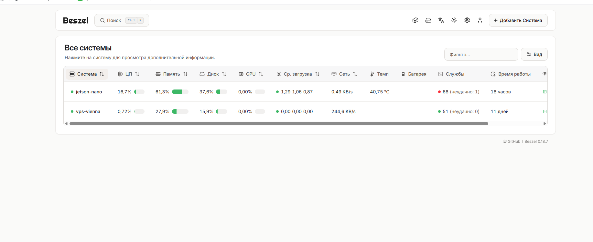
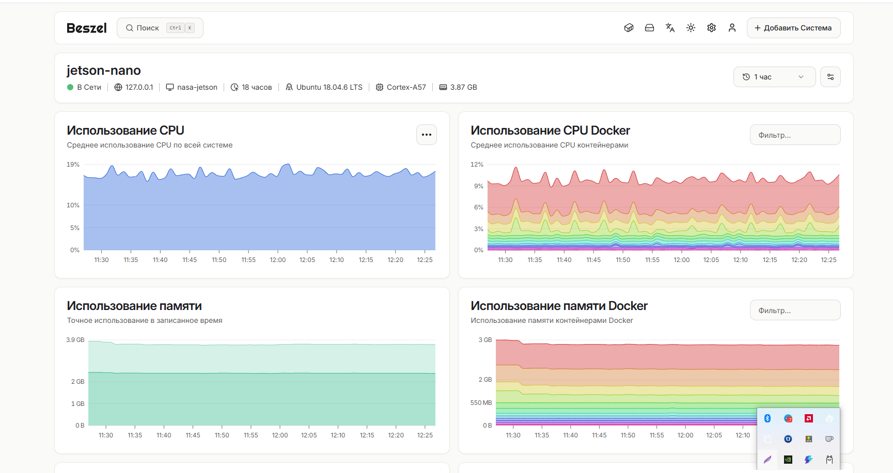
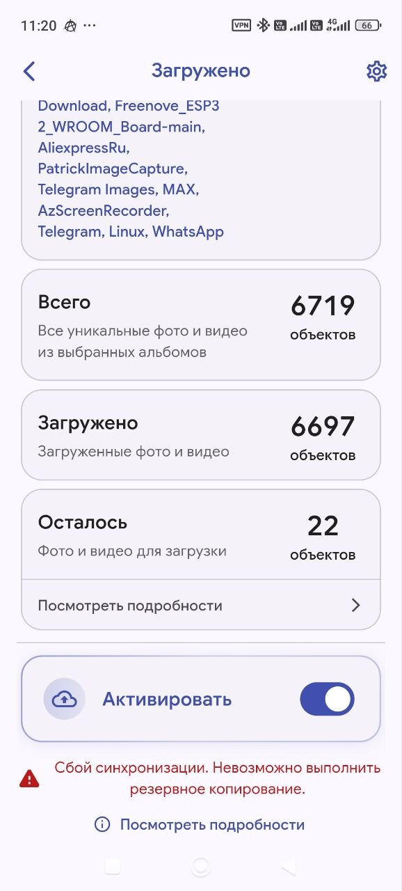
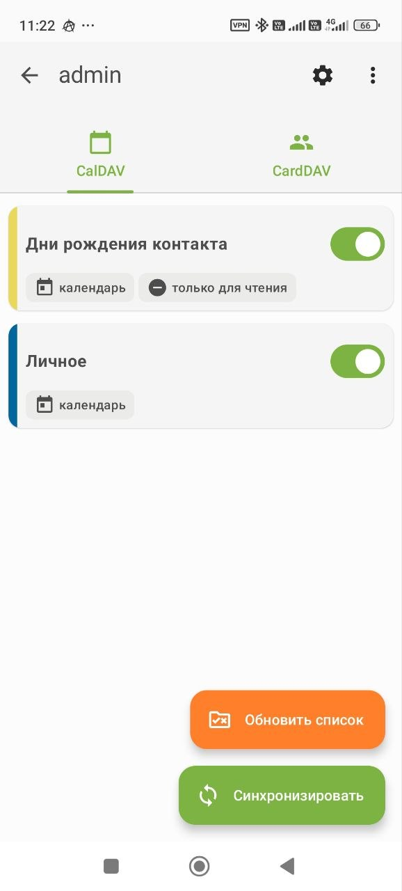
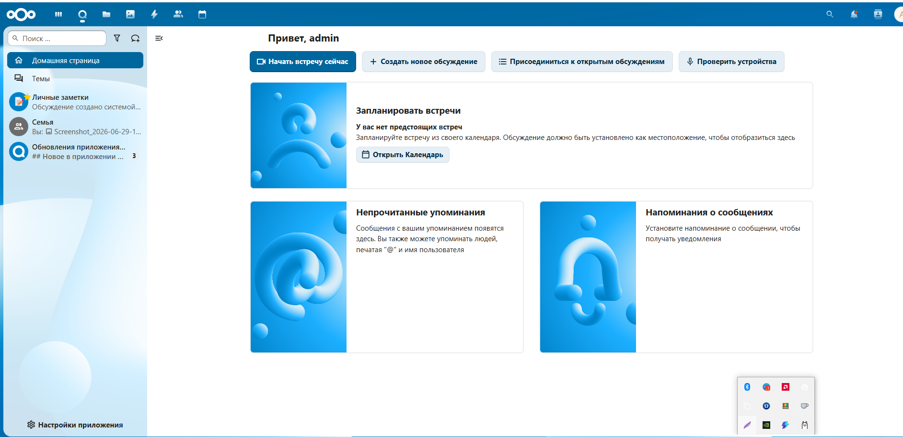
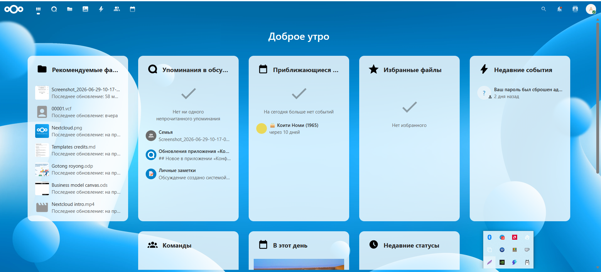
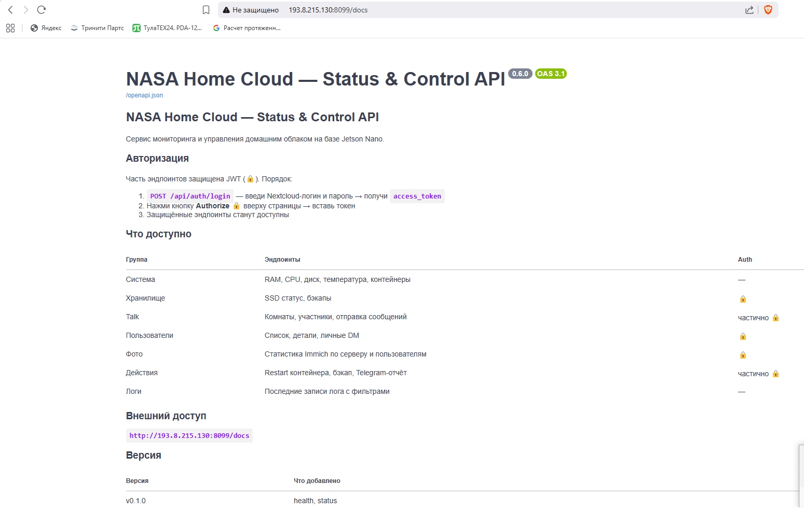
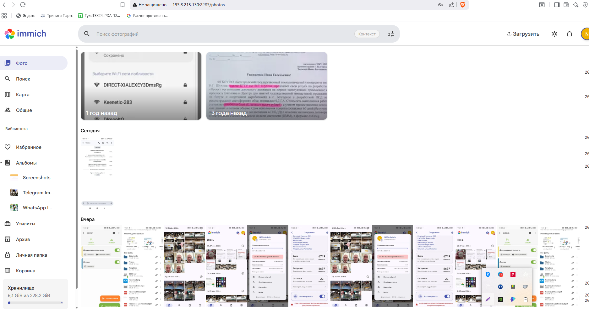

# Старому «железу» новую жизнь: домашнее облако на Jetson Nano и Claude Code

> **Хабы:** Системное администрирование · Open Source · Искусственный интеллект · Self-hosted  
> **Теги:** `selfhosted` `nextcloud` `immich` `jetson-nano` `docker` `homelab` `claude-code` `ai-assisted-dev`  
> **Репозиторий:** [github.com/AlexeyBorovskoy/Nasa_home](https://github.com/AlexeyBorovskoy/Nasa_home)

---

В связи с переездом перебирал дома старые коробки и нашёл NVIDIA Jetson Nano Developer Kit — сын всерьёз занимался робототехникой. Зная, сколько это стоило в своё время, решил поискать, куда его можно применить с учётом современных возможностей AI. В моём случае — это Claude Code, агентная CLI от Anthropic, которую я активно использую в работе.

Принимая во внимание, что у меня постоянно идёт переполнение аккаунта Google, возникла идея сделать локальное решение на базе Jetson. Провёл глубокий поиск подобных проектов и понял, что это реализуемо. Вторым пунктом, который позволил это достаточно просто сделать, стало наличие VPS-сервера — через него был организован доступ к домашнему ресурсу из интернета.

А теперь по порядку: что использовал из железа, какие задачи ставил, как решал.

<cut>

---

## Железо и первые ограничения

Что было на руках:

| Компонент | Характеристики |
|---|---|
| NVIDIA Jetson Nano Dev Kit | 4 GB LPDDR4, ARM64, GPU Maxwell |
| Системный диск | microSD 64 GB |
| Хранилище данных | USB SSD 232 GB → 229 GB (ext4) |
| VPS | Ubuntu 24.04, 2 GB RAM, Европа |
| Роутер | Статический IP для Jetson в домашней сети |

Первое, что выяснилось при работе с Jetson Nano — нет swap-раздела. Это серьёзно ограничивает выбор: например, Zabbix требует отдельной PostgreSQL и 500+ MB RAM, OpenMediaVault захватывает систему целиком. Docker 20.10.7 — старый, обновить нетривиально из-за зависимостей JetPack. ARM64 — не все образы имеют нативные сборки. Пришлось собирать гибридное решение из лёгких инструментов.

Отдельная история — внешнее хранилище. USB SSD — единственный вариант для нужного объёма. Но выяснилось, что не любой энклоужер работает стабильно с Jetson на kernel 4.9. Требования, которые пришли из практики:

- Работа в USB 3.0 BOT-режиме (не UAS — несовместим с Tegra kernel 4.9)
- Нет перехода в autosuspend при простое
- SCSI timeout не менее 60 секунд
- Стабильный чип без деградации скорости

В итоге остановился на энклоужере с чипом **JMS583** (5 Gbps). Write 250 MB/s, Read 172 MB/s — после одной строки в конфиге загрузчика:

```bash
# /boot/extlinux/extlinux.conf, добавить к строке APPEND:
usb-storage.quirks=152d:a583:u usbcore.autosuspend=-1
```

Флаг `u` переключает чип в BOT mode. Без него скорость записи была 8 MB/s вместо 250.

---

## Как я работал с Claude Code

Сразу скажу: я не писал техническое задание. Описывал жизненную ситуацию и проблему — агент предлагал реализацию, объяснял компромиссы, задавал уточняющие вопросы. Это принципиально другой подход, чем «дай мне скрипт для настройки nginx».

### Задача 1 — структура проекта

Стартовал с минимума: несколько конфигов и идея. Попросил агента привести это в порядок:

```
Приведи проект в порядок. Создай полный проект из данного,
напиши все необходимые подпапки и т.п.
Ориентируйся на использование субагентов
```

Claude Code запустил 4 параллельных субагента: один занялся скриптами диагностики и бэкапа, второй — Docker Compose файлами для всех сервисов, третий — GitHub-инфраструктурой (CI/CD, issue templates, CODEOWNERS), четвёртый — архитектурными решениями в виде ADR-документов. Я отвечал на уточняющие вопросы. За один сеанс получил структурированный репозиторий, который вручную расставлял бы несколько часов.

### Задача 2 — что поставить для мониторинга

Честно говоря, я сначала думал о Zabbix — привычный инструмент. Написал агенту:

```
Я хочу попробовать специальные инструменты по контролю типа Zabbix
или иных подобных решений. Проанализируй какие можно использовать.
```

Агент проанализировал 9 инструментов и объяснил почему Zabbix не подойдёт: нужна третья PostgreSQL, 500+ MB RAM — на Jetson без swap это OOM. Предложил лёгкую связку:

| Инструмент | Для чего | RAM |
|---|---|---|
| Netdata | Real-time метрики CPU/RAM/диск | ~80 MB |
| Uptime Kuma | HTTP/TCP мониторы, алерты | ~50 MB |
| Portainer | Управление Docker через браузер | ~50 MB |
| Beszel | История CPU/RAM/Disk, два сервера | ~30 MB |

Суммарно ~210 MB вместо 500+. Без этого объяснения я бы поставил Zabbix и получил OOM через пару дней.

### Задача 3 — внешний доступ через VPS

VPS у меня уже был — для семейного VPN. Написал агенту просто:

```
У меня есть внешний VPS, его можно использовать.
Ты можешь подключиться и проверить данный сервер.
```

Агент подключился по SSH, обнаружил работающий VPN-сервис (4 контейнера, ~25 клиентов) — не тронул его, установил Docker Compose, настроил UFW, создал nginx-конфигурацию для reverse-tunnel и задокументировал всё найденное. Важный момент: агент **сам определил что трогать нельзя** и зафиксировал это в `AGENTS.md`. Без этого я мог случайно уронить уже действующий сервис.

### AGENTS.md — это не документ, это память

Один из главных инсайтов проекта. `AGENTS.md` читается при каждом запуске новой сессии. Туда записываются жёсткие запреты, аппаратные ограничения, архитектурные решения и рабочий процесс. Агент не повторяет ошибки — потому что они зафиксированы.

Если собираетесь строить что-то с AI-агентом — начинайте именно с этого файла. Не с кода.

---

## Архитектура

### Доступ из интернета

Jetson стоит за домашним роутером в CGNAT — прямого входящего соединения нет. Решение — **reverse SSH tunnel** через VPS: Jetson сам устанавливает исходящее соединение, VPS проксирует трафик обратно.

```
[Смартфон / браузер / приложение]
         |
         | HTTPS / HTTP
         v
    [VPS в Европе]
    nginx (Docker)
    :8080 / :8443  ──┐
    :2283 / :2443  ──┤  reverse SSH tunnel (autossh)
    :8090 / :9443  ──┤
    :8099          ──┘
         |
         | SSH tunnel — исходящий от Jetson
         v
[Jetson Nano — домашняя сеть 192.168.x.x]
    Nextcloud    :8080   — файлы, фото, контакты
    Immich       :2283   — фотоархив
    LLM Gateway  :8090   — AI-ассистент
    NASA API     :8099   — управление и статистика
    Samba        :445    — только LAN
    Netdata      :19999  — метрики
    Uptime Kuma  :3001   — мониторинг
    Portainer    :9000   — Docker UI
         |
         | USB 3.0, 5 Gbps
         v
[JMS583 SSD 229 GB — /mnt/storage]
```

**Почему не WireGuard и не Tailscale?** WireGuard требует DKMS — несовместим с Tegra kernel 4.9. Tailscale конфликтует с уже работающим VPN на Android. autossh решает задачу без внешних зависимостей и работает стабильно через CGNAT с `Restart=always`.

**HTTPS без домена.** Let's Encrypt недоступен — нет доменного имени, а стандартный порт 443 занят другим сервисом. Вышел из ситуации через self-signed TLS на alt-портах (:8443, :2443, :9443) со сроком 10 лет. Браузер предупреждает один раз — принять сертификат и больше к этому не возвращаться.

### 13 контейнеров на 4 GB RAM

Ключевые принципы при дизайне: `mem_limit` для каждого контейнера и `restart: always`. Без mem_limit один контейнер может занять всю память.

| Контейнер | Образ | Порт | mem_limit |
|---|---|---|---|
| nextcloud | nextcloud:apache | 8080 | 512m |
| nextcloud_db | postgres:16-alpine | — | 512m |
| nextcloud_redis | redis:7-alpine | — | 64m |
| immich_server | immich-server:release | 2283 | 1024m |
| immich_db | pgvecto-rs:pg16 | — | 384m |
| immich_redis | redis:7-alpine | — | 64m |
| immich_microservices | immich-server:release | — | 512m |
| llm_gateway | custom FastAPI | 8090 | 256m |
| nasa_api | custom FastAPI | 8099 | 128m |
| samba | crazymax/samba | 445 | — |
| netdata | netdata:latest | 19999 | 256m |
| uptime_kuma | louislam/uptime-kuma | 3001 | 128m |
| portainer | portainer-ce | 9000 | 128m |

`IMMICH_DISABLE_MACHINE_LEARNING=true` — без этого флага Immich не запустится стабильно на 4 GB без swap.

---

## Как доводил проект — шаг за шагом

### Шаг 1 — Запуск базовых сервисов

Начал с Nextcloud и Immich. Промпт агенту был простым:

```
Подними Nextcloud и Immich на Jetson Nano.
PostgreSQL для обоих. Данные на /mnt/storage.
Учти: нет swap, 4 GB RAM.
```

Агент написал Docker Compose файлы с mem_limit и healthcheck-ами, а также добавил fail-closed логику в скрипт бэкапа: если `/mnt/storage` не смонтирован как отдельное устройство — бэкап не запускается. Это защита от случайного сохранения данных на microSD вместо SSD.

Проверял так:
```bash
docker compose ps
curl -s http://localhost:8080/status.php | python3 -m json.tool
curl -s http://localhost:2283/api/server/ping
```

### Шаг 2 — Мониторинг и ежедневный отчёт

Хотел понимать, что происходит с системой ночью, когда я сплю. Попросил агента настроить Telegram-бот с ежедневным отчётом. В итоге каждое утро в 09:00 приходит сообщение:

```
NASA HOME CLOUD — Daily Report

SYSTEM
Uptime: 18h | RAM: 2.3/3.9G | Disk: 7G/229G (3%)
Temp: CPU 41°C · GPU 40°C

CONTAINERS
✅ nextcloud: running (restarts: 0)
✅ immich_server: running (restarts: 0)
... (все 13)

LOCAL HTTP    ✅ Nextcloud 302  ✅ Immich 200
EXTERNAL      ✅ Nextcloud VPS  ✅ Immich VPS
```

Параллельно поднял **Beszel Hub** на VPS — исторические графики CPU/RAM/Disk по обоим серверам. Особенно полезно когда нужно понять, что происходило часом раньше.





### Шаг 3 — Автоматические тесты инфраструктуры

После каждого изменения хотел быть уверен, что ничего не сломал. Агент предложил goss — лёгкий инструмент проверки состояния инфраструктуры. Установка на ARM64:

```bash
curl -fsSL https://goss.rocks/install | GOSS_VER=v0.4.9 sh
goss validate --gossfile tests/goss/goss.yaml
```

40 тестов: порты открыты, systemd-сервисы активны, нужные файлы существуют, HTTP-эндпоинты отвечают. Теперь после любых изменений запускаю goss и смотрю результат:

```
Count: 40, Failed: 0, Skipped: 0 — Duration: 4.32s
```

### Шаг 4 — HTTPS для Android-приложений

Выяснилось, что Immich на Android требует HTTPS для автобэкапа, а DAVx⁵ отказывается синхронизировать контакты по HTTP. Без доменного имени сделал self-signed сертификат и прописал IP в SAN:

```bash
openssl req -x509 -nodes -days 3650 -newkey rsa:2048 \
  -keyout /opt/nasa/nginx/ssl/nasa.key \
  -out /opt/nasa/nginx/ssl/nasa.crt \
  -subj "/CN=nasa-home-cloud" \
  -addext "subjectAltName=IP:ваш_VPS_IP, IP:192.168.x.x"
```

nginx на VPS добавил HTTPS-блоки на alt-портах. Приложение один раз спрашивает «доверять сертификату?» — после этого работает как обычно.

### Шаг 5 — Android-клиенты

Подключение семьи к системе потребовало учесть специфику телефонов Xiaomi с MIUI/HyperOS. Попросил агента написать инструкцию — он добавил разделы про battery whitelist и автозапуск приложений, без которых Immich не делает бэкап в фоне.

Результат: 6 697 фотографий и видео загружено с телефона. Автобэкап работает стабильно.



Контакты синхронизировал через DAVx⁵ — 2 151 запись, CalDAV и CardDAV:



### Шаг 6 — Семейный чат и раздача доступов

Nextcloud Talk — мессенджер, встроенный прямо в Nextcloud. Создал группу на 5 человек. История переписки хранится на домашнем SSD, а не на серверах сторонних сервисов.

Каждому члену семьи сделал персональную памятку на одну страницу: URL, логин, шаги настройки на Android — без единого технического термина. Агент помог написать эти инструкции: я описал аудиторию, он адаптировал язык.





### Шаг 7 — REST API поверх всего стека

Последний шаг — захотел управлять системой не через SSH, а программно: смотреть статистику, перезапускать контейнеры, получать данные о фотоархиве. Промпт:

```
Создай FastAPI сервис. Пусть он умеет:
- авторизоваться через Nextcloud (JWT)
- читать состояние Docker-контейнеров
- отправлять сообщения в Talk
- показывать статистику Immich
- перезапускать контейнеры по whitelist
Swagger UI обязателен.
```

Агент написал 9 роутеров, Pydantic-модели, JWT middleware, полную OpenAPI-документацию. Итог — 20 эндпоинтов:

| Группа | Что делает |
|---|---|
| Система | RAM, CPU, температура, список контейнеров |
| Talk | Список чатов, участники, отправка сообщений |
| Пользователи | Семейные аккаунты, личные сообщения через Talk |
| Фото | Статистика Immich: 6 484 фото, 210 видео, 4.24 GB |
| Действия | Restart контейнера, запуск бэкапа по требованию |



---

## Что получилось в итоге



**Цифры:**
- 13 Docker-контейнеров — все up/healthy
- 6 697 фотографий и видео загружено с телефонов
- 2 151 контакт синхронизируется через DAVx⁵
- 5 человек в семейном чате
- goss 40/40 — инфраструктурные тесты
- SSD Write 250 MB/s, Read 172 MB/s

**Что заменили:**
- Google Photos → Immich (автобэкап, альбомы, поиск)
- Google Drive / Яндекс.Диск → Nextcloud (файлы, синхронизация)
- Google Contacts → DAVx⁵ + Nextcloud CardDAV
- Telegram/WhatsApp группы → Nextcloud Talk (история на своём SSD)

---

## Честная оценка

**Что AI реально ускоряет:**

Скорость реализации кратно выше. systemd-юниты, udev-правила, nginx-конфиги, Docker Compose — агент пишет это параллельно, не забывая про детали: mem_limit, restart policy, healthcheck-и. На это ушли бы недели изучения документации, а так — часы объяснений из своей ситуации.

Документация создаётся вместе с кодом. ADR (Architecture Decision Records), CHANGELOG, двуязычные инструкции — без агента я бы откладывал это месяцами. Ошибки фиксируются в AGENTS.md и не повторяются в следующих сессиях.

CI/CD в GitHub Actions, secrets-check перед каждым push, shellcheck для bash-скриптов — агент знает open-source конвенции и применяет их без напоминания.

**Где без человека не обойтись:**

Агент не знает конкретное железо. Нужно объяснять: какой чип в USB-мосте, реальное количество RAM, версию kernel, что на VPS нельзя трогать. Без этого контекста рекомендации будут обобщёнными и иногда нерабочими.

Финальная проверка безопасности — только человеком. Firewall, fstab, пароли — читать и верифицировать самому. Агент напишет конфиг, но ответственность за то что он делает — ваша.

**Что ещё не сделано (честно):**

- Docker 20.10.7 устарел — обновить нетривиально из-за JetPack зависимостей
- Off-site backup не настроен — скрипты restic готовы, на VPS не развёрнут
- ML в Immich отключён — Jetson 4 GB без swap не тянет распознавание лиц

---

## Итог

Jetson Nano из коробки превратился в работающий семейный сервер за несколько вечеров. Семья использует — не тестирует. Фотографии больше не лежат в Google.

Главный вывод: AI-агент — не волшебная кнопка. Это инструмент, который резко снижает стоимость реализации, если умеешь описывать задачу из реальной ситуации, а не из технического словаря. Чем точнее контекст — тем точнее результат.

Промпты агентов, ADR, Docker Compose, скрипты, памятки пользователей — всё открыто:
**[github.com/AlexeyBorovskoy/Nasa_home](https://github.com/AlexeyBorovskoy/Nasa_home)**
